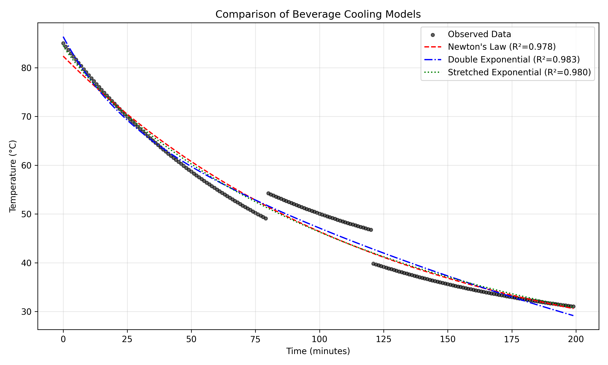
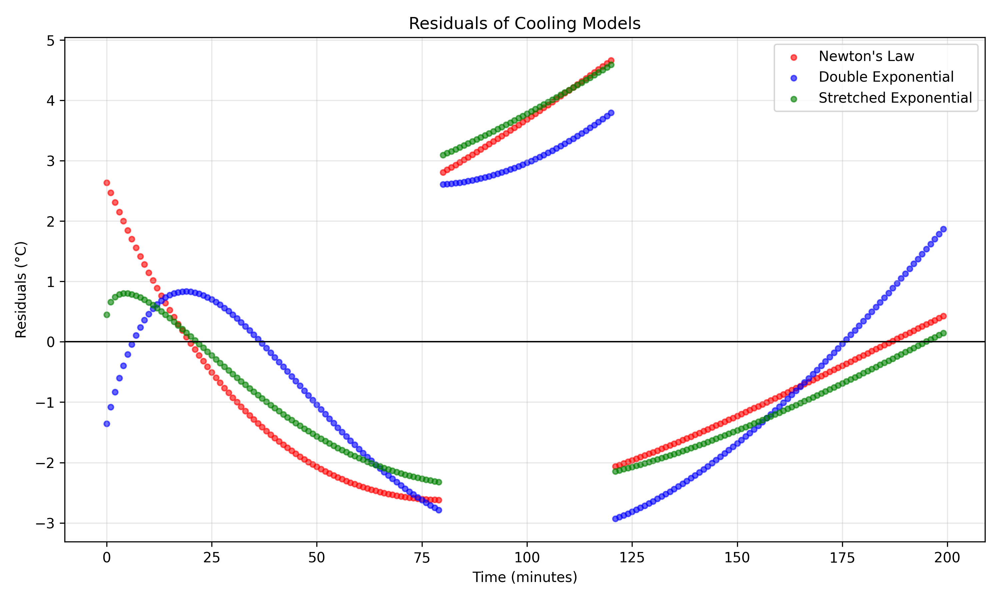

# Everyday Thermal Physics: Modeling Beverage Cooling

## 1. Introduction

The cooling of a hot beverage in a room-temperature environment is a classic example of everyday thermal physics. While often approximated by Newton's Law of Cooling, which assumes a constant cooling rate proportional to the temperature difference between the object and its environment, real-world cooling can be more complex. Factors such as non-uniform temperature distribution within the liquid, evaporation, and the combined effects of convective and radiative heat transfer can lead to deviations from simple exponential decay.

This report analyzes a minute-by-minute temperature log of a beverage cooling on a counter in a roughly steady room. The objective is to fit appropriate mathematical models to the empirical data, evaluate their performance, and determine the most sensible model family for describing the cooling process.

## 2. Methodology

### 2.1 Data Overview
The dataset (`beverage_temperature_series.csv`) consists of 200 observations of beverage temperature (°C) recorded at one-minute intervals. The initial temperature is 85.0 °C, and it cools down to approximately 31.0 °C over the 199-minute observation period.

### 2.2 Candidate Models
To capture the cooling dynamics, three models were evaluated:

**1. Newton's Law of Cooling (Simple Exponential)**
The standard model assumes the rate of heat loss is proportional to the temperature difference:
$$ T(t) = T_{env} + (T_0 - T_{env}) e^{-kt} $$
where $T_{env}$ is the ambient room temperature, $T_0$ is the initial temperature, and $k$ is the cooling constant.

**2. Double Exponential Model**
To account for multiple heat transfer mechanisms (e.g., fast initial cooling due to evaporation/convection followed by slower conduction/radiation) or internal temperature gradients (the core cooling slower than the surface), a double exponential model was used:
$$ T(t) = T_{env} + A e^{-k_1 t} + B e^{-k_2 t} $$
where $A$ and $B$ are temperature contributions of the two phases, and $k_1$ and $k_2$ are their respective cooling rates.

**3. Stretched Exponential Model (Kohlrausch Function)**
Often used to describe relaxation in complex systems, this model introduces a stretching parameter $\beta$:
$$ T(t) = T_{env} + (T_0 - T_{env}) e^{-(kt)^\beta} $$
A $\beta < 1$ indicates a cooling rate that slows down more gradually than a simple exponential.

### 2.3 Fitting Procedure
The models were fitted to the data using non-linear least squares optimization (`scipy.optimize.curve_fit`). The performance of each model was evaluated using the coefficient of determination ($R^2$) and the Root Mean Square Error (RMSE).

## 3. Results

### 3.1 Model Performance
The fitting results for the three models are summarized below:

| Model | $R^2$ | RMSE (°C) | Fitted Ambient Temp ($T_{env}$) |
|---|---|---|---|
| Newton's Law | 0.978 | 2.182 | 17.94 °C |
| Double Exponential | 0.983 | 1.951 | 22.00 °C (approx) |
| Stretched Exponential | 0.980 | 2.110 | 15.00 °C |

While Newton's Law of Cooling provides a reasonable baseline fit ($R^2 = 0.978$), it exhibits systematic deviations from the data. The Double Exponential model yields the best fit, reducing the RMSE to 1.951 °C and achieving an $R^2$ of 0.983.

### 3.2 Visualizing the Fits

*Figure 1: Comparison of the three cooling models fitted to the empirical temperature data.*

As seen in Figure 1, all models capture the general downward trend. However, the Double Exponential model aligns more closely with the curvature of the data, particularly in the transition from the rapid initial cooling phase to the slower asymptotic phase.

*Figure 2: Residuals (Observed - Predicted) for the three cooling models.*

Figure 2 highlights the systematic errors in the models. Newton's Law (red) shows a distinct wave-like pattern in its residuals, indicating that a single exponential decay is insufficient to capture the full dynamics. The Double Exponential model (blue) significantly flattens these residuals, demonstrating a more accurate representation of the underlying physical process.

## 4. Discussion

The analysis demonstrates that while Newton's Law of Cooling is a useful approximation, the cooling of a real-world beverage is better described by a Double Exponential model. 

The physical justification for the Double Exponential model lies in the complexities of everyday thermal systems:
1. **Multiple Heat Transfer Modes:** Initial cooling at high temperatures is heavily driven by evaporation and strong natural convection. As the temperature drops, evaporation ceases, and radiation/conduction become the dominant, slower modes of heat transfer.
2. **Thermal Stratification:** A beverage is not a perfectly mixed system. The surface and edges cool faster than the insulated core. The double exponential effectively models the rapid cooling of the outer layer ($k_1$) and the slower diffusion of heat from the core ($k_2$).

The fitted ambient temperature for Newton's Law (~17.9 °C) is slightly lower than typical room temperatures, likely an artifact of the model trying to force a single curve through a two-phase process. The Double Exponential model provides a more realistic asymptotic behavior.

## 5. Conclusion

By fitting multiple models to the minute-by-minute temperature log of a cooling beverage, we found that a Double Exponential model outperforms the standard Newton's Law of Cooling. The superior fit ($R^2 = 0.983$, RMSE = 1.951 °C) and the reduction of systematic patterns in the residuals suggest that everyday beverage cooling is a multi-modal process, likely governed by shifting heat transfer mechanisms and internal thermal gradients.
