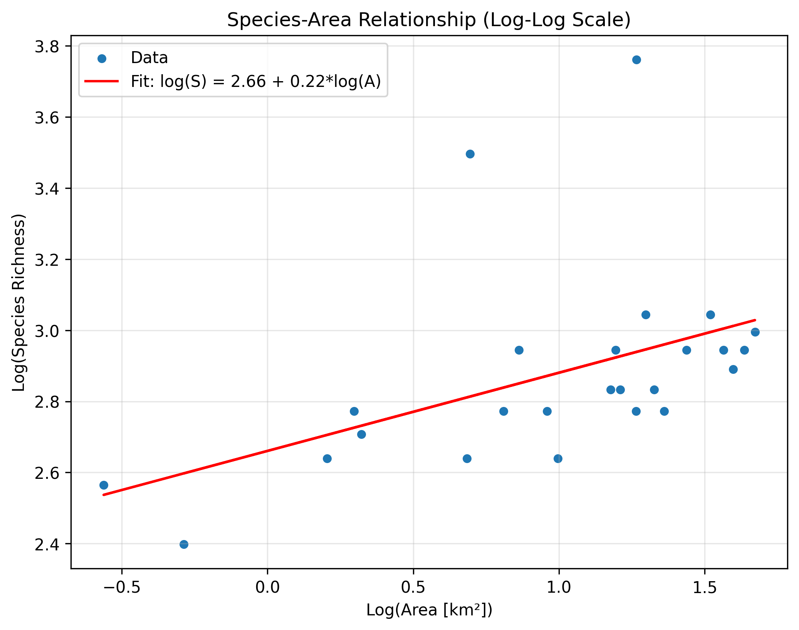
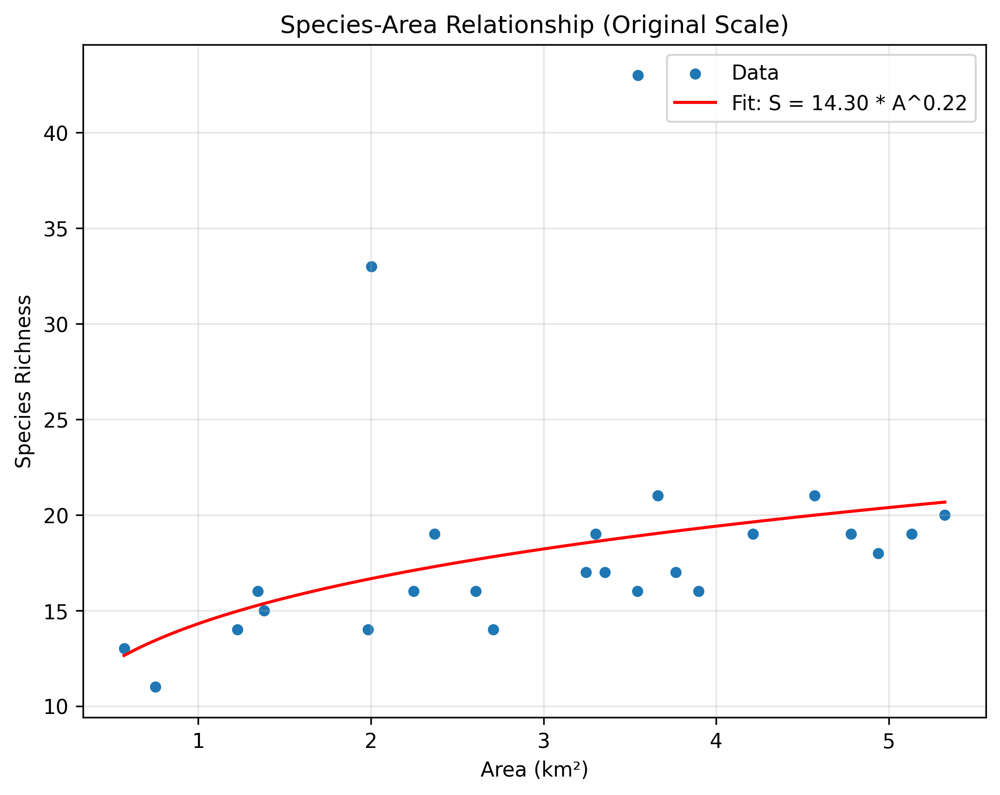
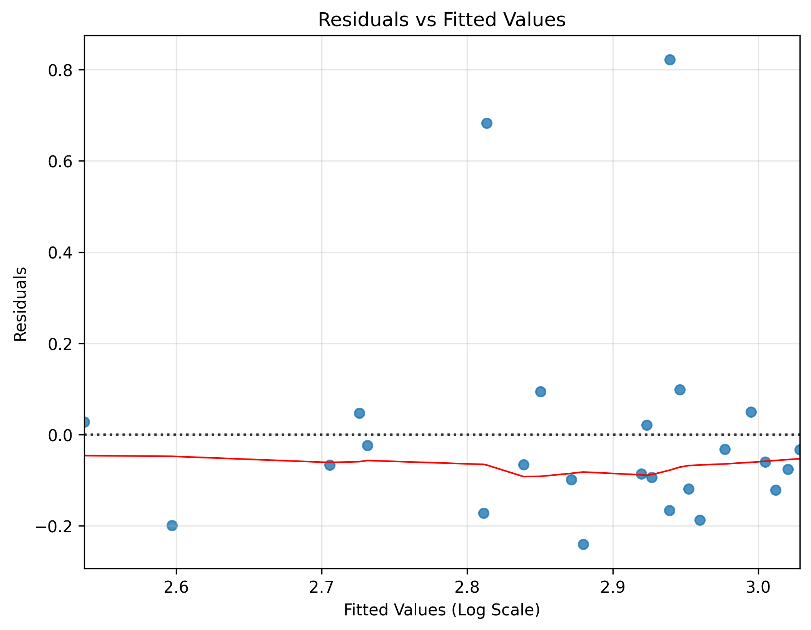

# Species-Area Relationship and Implications for Conservation Planning

## 1. Introduction
The theory of island biogeography posits a fundamental relationship between the area of an isolated habitat (such as an island) and the number of species it can support. This species-area relationship (SAR) is typically modeled using the power law equation $S = cA^z$, where $S$ is species richness, $A$ is the habitat area, and $c$ and $z$ are constants. The parameter $z$ represents the rate at which species richness increases with area and is a critical metric in ecology. Understanding this relationship is essential for conservation planning, particularly in the design of nature reserves and the management of fragmented habitats.

This report analyzes the species-area relationship using a dataset of island areas and species richness, and discusses the implications of the findings for conservation strategies.

## 2. Methodology
### 2.1 Data Description
The dataset `island_species.csv` contains observations from 25 islands. For each island, the dataset provides:
- `island_id`: A unique identifier for the island.
- `area_km2`: The area of the island in square kilometers.
- `species_richness`: The total number of species observed on the island.

The island areas range from 0.57 km² to 5.32 km², with a mean of 3.06 km². Species richness ranges from 11 to 43 species, with a mean of 18.52 species.

### 2.2 Statistical Modeling
To model the species-area relationship, the power law equation $S = cA^z$ was linearized using a natural logarithmic transformation:

$$\log(S) = \log(c) + z \log(A)$$

Ordinary Least Squares (OLS) regression was performed on the log-transformed variables to estimate the parameters $\log(c)$ (the intercept) and $z$ (the slope). The analysis was conducted using Python with the `pandas`, `numpy`, and `statsmodels` libraries. Model assumptions were checked using residual analysis.

## 3. Results
### 3.1 Regression Analysis
The OLS regression on the log-transformed data yielded a statistically significant positive relationship between island area and species richness ($F(1, 23) = 6.603, p = 0.0171$). 

The estimated parameters are:
- **Intercept ($\log(c)$):** 2.6606 ($p < 0.001$)
- **Slope ($z$):** 0.2200 ($p = 0.017$)

Transforming the intercept back to the original scale gives $c = \exp(2.6606) \approx 14.30$. Therefore, the fitted species-area relationship is:

$$S = 14.30 \times A^{0.22}$$

The model explains approximately 22.3% of the variance in log species richness ($R^2 = 0.223$). The $z$-value of 0.22 falls well within the typical range observed for true islands (0.20 to 0.35), indicating a standard rate of species accumulation with increasing area.

### 3.2 Visualizations

*Figure 1: Log-log plot of species richness versus island area. The red line represents the fitted linear regression model.* 

*Figure 2: Species richness versus island area on the original scale. The red curve represents the fitted power law model $S = 14.30 A^{0.22}$.*

*Figure 3: Residuals versus fitted values for the log-log regression model. The plot helps assess the homoscedasticity assumption.*

## 4. Discussion and Conservation Implications
The analysis confirms a significant species-area relationship, with a $z$-value of 0.22. This finding has several important implications for conservation planning:

1. **Reserve Size and SLOSS Debate:** The positive $z$-value demonstrates that larger areas support more species. In the context of the Single Large or Several Small (SLOSS) debate, a $z$-value of 0.22 suggests that a single large reserve will generally protect more species than several small reserves of the same total area, assuming the habitats are similar. This is because the species accumulation curve does not plateau rapidly.

2. **Habitat Fragmentation:** As continuous habitats are fragmented into smaller, isolated "islands" (e.g., forest patches in an agricultural landscape), the area of each patch decreases. The power law model predicts a corresponding non-linear loss of species. Because $z < 1$, initial reductions in area may not cause drastic species loss, but as patches become very small, the rate of species extinction will accelerate.

3. **Extinction Debt:** When a habitat is reduced in size, it initially holds more species than its new area can support at equilibrium. Over time, the habitat will "relax" to a lower species richness predicted by the SAR. Conservationists must recognize that current species counts in recently fragmented habitats may overestimate their long-term carrying capacity.

4. **Corridors and Connectivity:** Since individual small reserves can only support a limited number of species, establishing ecological corridors between them can effectively increase the functional area ($A$) available to populations, thereby increasing the overall species richness ($S$) the network can sustain.

## 5. Conclusion
The empirical data strongly supports the species-area relationship, yielding a characteristic $z$-value of 0.22. This mathematical relationship provides a foundational tool for conservation biology, emphasizing the critical importance of preserving large, contiguous tracts of habitat to maintain biodiversity and mitigate the impacts of habitat fragmentation.