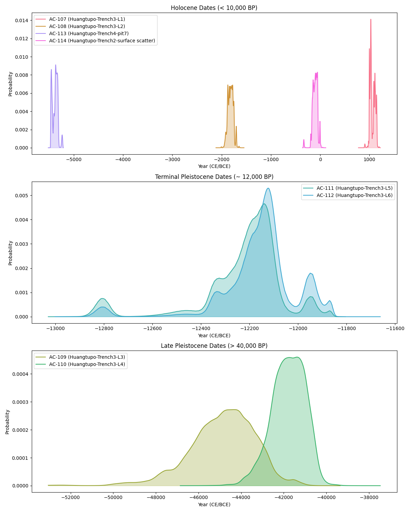
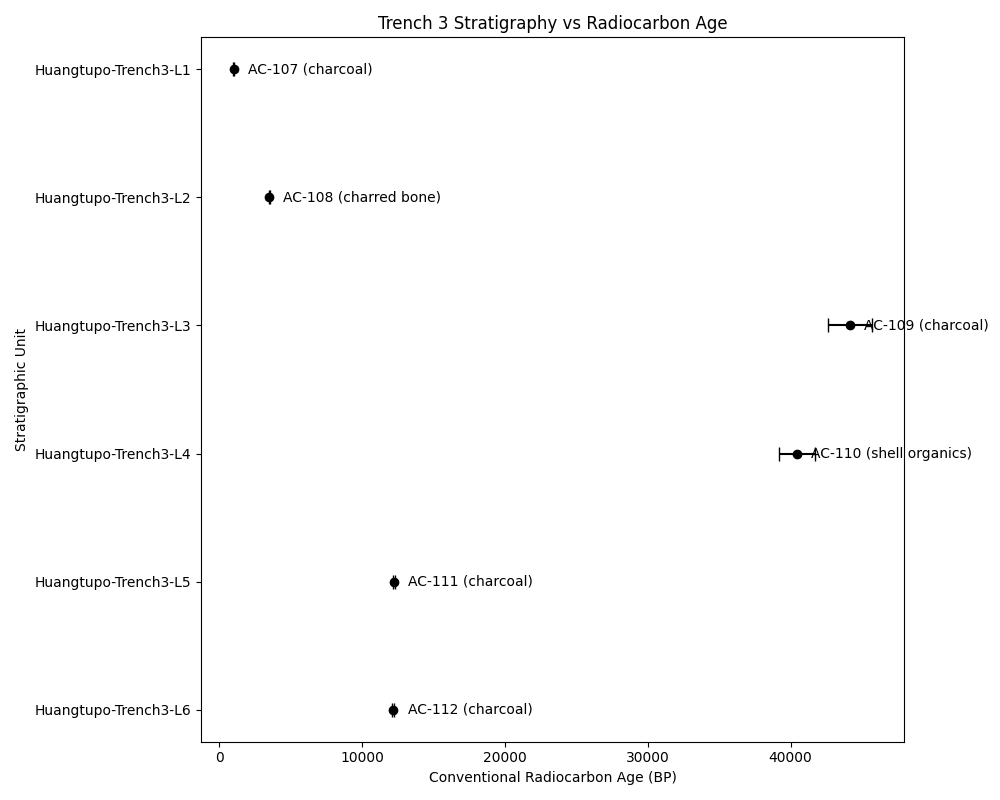

# Radiocarbon Site Chronology of Huangtupo

## 1. Introduction

This report presents the radiocarbon chronology for the Huangtupo archaeological site. Eight radiocarbon assays were analyzed to establish a timeline for the site's occupation and to evaluate the integrity of its stratigraphic sequence. The primary goals of this analysis are to calculate conventional radiocarbon ages and calibrated calendar dates for each sample, assess the relative chronology based on stratigraphic context, and provide a cultural periodization sketch for the site.

## 2. Methodology

### 2.1 Data Processing

The dataset consists of eight radiocarbon measurements (`f14_residual_ratio` and `sigma_f14_absolute`) from various stratigraphic units and materials. The fraction of modern carbon ($F^{14}C$) was converted to conventional radiocarbon years Before Present (BP) using Libby's mean life formula:

$$ Age_{BP} = -8033 \times \ln(F^{14}C) $$

The associated 1$\sigma$ uncertainty was calculated as:

$$ \sigma_{BP} = 8033 \times \left( \frac{\sigma_{F^{14}C}}{F^{14}C} \right) $$

To avoid numerical instability, $F^{14}C$ values were clipped to a minimum of $10^{-10}$ and a maximum of $1.0$. The resulting ages and uncertainties were rounded to the nearest integer for calibration.

### 2.2 Calibration

Calibration of the conventional radiocarbon ages to calendar years (CE/BCE) was performed using the `iosacal` Python package with the IntCal20 calibration curve. The 95% highest posterior density (HPD) intervals were extracted for each sample to provide calendar age ranges.

## 3. Results

### 3.1 Radiocarbon Ages and Calibration

The calculated conventional radiocarbon ages and their calibrated 95% confidence intervals are summarized in Table 1.

**Table 1: Radiocarbon Measurements and Calibrated Dates**

| Artifact ID | Stratigraphic Unit | Material | Age (BP) | $\pm 1\sigma$ | Calibrated Date (95% HPD) |
|---|---|---|---|---|---|
| AC-107 | Trench3-L1 | charcoal | 1000 | 36 | 992 CE to 1052 CE (50.7%); 1062 CE to 1066 CE (0.8%); 1076 CE to 1156 CE (43.1%) |
| AC-108 | Trench3-L2 | charred bone | 3498 | 37 | 1925 BCE to 1740 BCE (92.3%); 1712 BCE to 1697 BCE (2.3%) |
| AC-109 | Trench3-L3 | charcoal | 44156 | 1567 | 48154 BCE to 41993 BCE (95.4%) |
| AC-110 | Trench3-L4 | shell organics | 40454 | 1236 | 43397 BCE to 40337 BCE (95.4%) |
| AC-111 | Trench3-L5 | charcoal | 12211 | 73 | 12853 BCE to 12764 BCE (4.9%); 12485 BCE to 12044 BCE (90.5%) |
| AC-112 | Trench3-L6 | charcoal | 12181 | 73 | 12815 BCE to 12798 BCE (0.7%); 12374 BCE to 11888 BCE (94.7%) |
| AC-113 | Trench4-pit7 | charcoal | 6397 | 36 | 5473 BCE to 5422 BCE (28.2%); 5420 BCE to 5309 BCE (67.2%) |
| AC-114 | Trench2-surface | charcoal | 2089 | 31 | 196 BCE to 184 BCE (1.7%); 178 BCE to 38 BCE (93.7%) |

The probability distributions of the calibrated dates are visualized in Figure 1, split into three panels to accommodate the wide temporal range of the samples.

*Figure 1: Probability distributions of calibrated radiocarbon dates for the Huangtupo site, separated by temporal period.* 

### 3.2 Stratigraphic Analysis

Trench 3 provides a vertical sequence from Layer 1 (L1, top) to Layer 6 (L6, bottom). A plot of the conventional radiocarbon ages against the stratigraphic units reveals significant inversions (Figure 2).

*Figure 2: Conventional radiocarbon ages plotted against stratigraphic units for Trench 3. Note the significant age inversions in the middle layers.*

While L1 (1000 BP) and L2 (3498 BP) follow the expected chronological order, L3 (44156 BP) and L4 (40454 BP) are anomalously old. Furthermore, L5 (12211 BP) and L6 (12181 BP) are significantly younger than the overlying L3 and L4, indicating a major stratigraphic disturbance or issues with the samples themselves.

## 4. Discussion

### 4.1 Stratigraphic Integrity and Anomalies

The sequence in Trench 3 is highly problematic. The dates for L5 and L6 (AC-111 and AC-112) are consistent with each other (~12,200 BP) and represent a Terminal Pleistocene occupation. However, they are overlain by L3 and L4, which yielded dates >40,000 BP. 

Several factors could explain these anomalies:
1.  **Sample AC-109 (L3):** The field notes indicate a "very small carbon yield post-pretreatment." Small samples are highly susceptible to contamination by older carbon (e.g., geological carbonates or older residual charcoal), which could artificially inflate the age.
2.  **Sample AC-110 (L4):** This sample is "shell organics" with a "marked reservoir correction discussion pending." Shells often incorporate old carbon from dissolved inorganic carbon in water (the hardwater effect), leading to ages that are significantly older than the true depositional age. Without a local reservoir correction, this date is unreliable for establishing the site chronology.
3.  **Stratigraphic Mixing:** The presence of >40,000 BP material above ~12,200 BP material suggests severe stratigraphic mixing, possibly due to natural processes (e.g., cryoturbation, slope wash) or anthropogenic activities (e.g., pit digging, terracing) that brought older material to the surface, which was subsequently redeposited.

Sample AC-114 from Trench 2 (surface scatter) dates to ~2000 BP but was flagged for "root intrusion risk." Rootlets introduce modern carbon, which would make the sample appear younger than its true age. Therefore, this date should be treated as a minimum age.

### 4.2 Cultural Periodization Sketch

Despite the stratigraphic issues in Trench 3, the reliable dates suggest multiple phases of activity at the Huangtupo site:

1.  **Late Pleistocene / Paleolithic (>40,000 BP):** The dates from L3 and L4, while stratigraphically inverted, indicate the presence of very old carbon in the vicinity, potentially reflecting an early human presence or simply old environmental carbon.
2.  **Terminal Pleistocene (~12,200 BP):** Samples AC-111 and AC-112 provide a solid chronological anchor for a Terminal Pleistocene occupation, likely corresponding to a Late Paleolithic or transitional phase.
3.  **Middle Holocene (~6400 BP):** Sample AC-113 from Trench 4 (pit 7) dates to ~5400-5300 BCE, indicating a Neolithic occupation.
4.  **Late Holocene (~3500 BP):** Sample AC-108 from Trench 3 (L2) dates to ~1900-1700 BCE, corresponding to the Bronze Age.
5.  **Late Historical (~1000 BP):** Sample AC-107 from Trench 3 (L1) dates to ~1000-1150 CE, representing historical period activity (e.g., Song Dynasty in a Chinese context).

## 5. Conclusion

The radiocarbon chronology of the Huangtupo site reveals a long history of activity spanning from the Terminal Pleistocene to the historical period. However, the stratigraphic sequence in Trench 3 is severely compromised by inversions, likely due to a combination of sample-specific issues (small yield, reservoir effects) and post-depositional mixing. Future work should focus on obtaining dates from more secure contexts, applying appropriate reservoir corrections for shell samples, and carefully evaluating samples for contamination.
