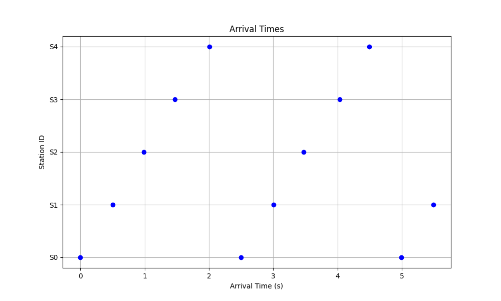
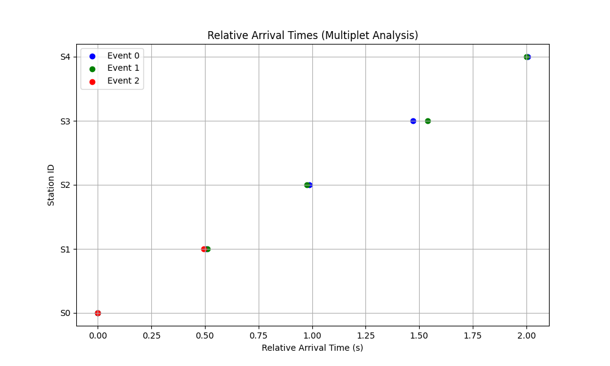
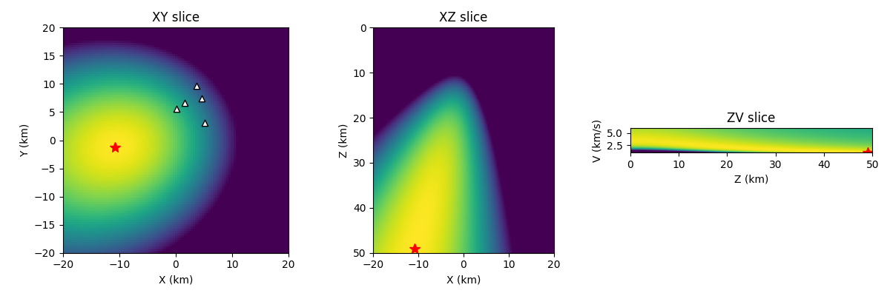
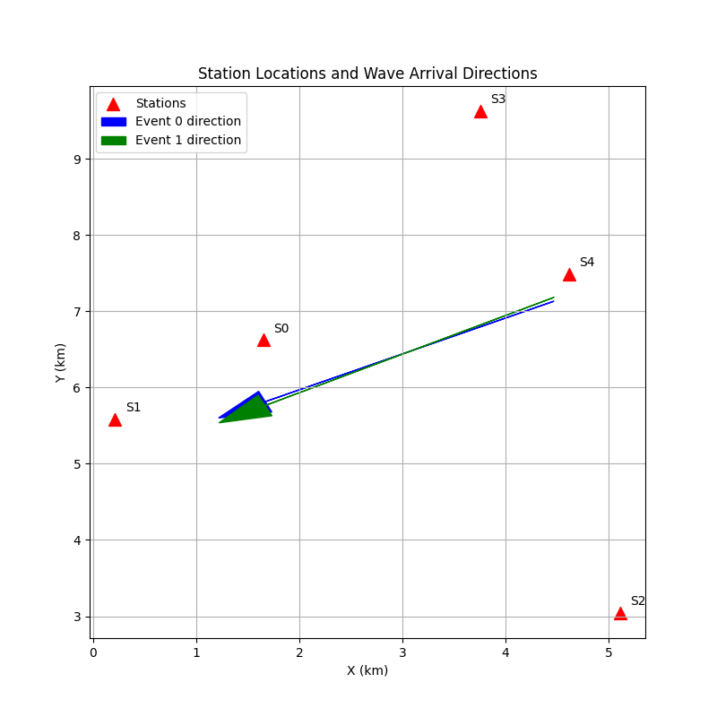

# Microseismic Analysis Brief: Source Clustering and Structural Context

## 1. Introduction

Microseismic monitoring is a critical tool for understanding subsurface processes, such as fluid injection, hydraulic fracturing, or natural fault reactivation. This brief presents an analysis of a microseismic dataset comprising arrival times at a network of five stations. The primary objectives are to identify distinct seismic events, determine their locations, analyze source clustering, and infer the structural context of the seismicity.

## 2. Data Overview

The dataset consists of two files:
*   `stations.csv`: Contains the coordinates (X, Y, Z in km) of five seismic stations (S0 to S4). The stations are deployed at the surface (Z=0 km) and span an area of approximately 5 km by 10 km.
*   `arrival_times.csv`: Contains 12 P-wave arrival picks, including the event ID, station ID, and arrival time in seconds.

An initial inspection of the arrival times reveals three distinct temporal clusters, which we interpret as three separate microseismic events:
*   **Event 0**: Arrivals at all 5 stations, starting around t = 0 s.
*   **Event 1**: Arrivals at all 5 stations, starting around t = 2.5 s.
*   **Event 2**: Arrivals at only 2 stations (S0 and S1), starting around t = 5.0 s.

*Figure 1: P-wave arrival times at the five stations, showing three distinct events.*

## 3. Methodology

### 3.1. Multiplet Analysis

To investigate source clustering, we first analyzed the relative arrival times of the events across the station network. Events that occur at nearly the same spatial location will produce nearly identical relative arrival times at the stations, regardless of their absolute origin times. Such events are known as multiplets or repeating earthquakes.

We calculated the relative arrival times for each event by subtracting the arrival time at station S0 (the first station to record each event) from the arrival times at all other stations.

### 3.2. Source Location

For the events with sufficient arrivals (Event 0 and Event 1), we performed source location using a grid search approach. The objective was to find the spatial coordinates (X, Y, Z) and the uniform P-wave velocity (V) that minimize the variance of the estimated origin times across all stations.

Given the strong similarity in relative arrival times between Event 0 and Event 1 (as shown in the Results section), we used the average relative arrival times of the two events to perform a joint location inversion. This approach increases the robustness of the location estimate for the multiplet cluster.

The grid search was performed over a wide spatial domain and a range of plausible P-wave velocities (1.0 to 6.0 km/s). The optimal location was identified as the grid point with the minimum origin time variance.

### 3.3. Plane Wave Approximation

As an independent check on the source direction and apparent velocity, we applied a plane wave approximation to the arrival times of Event 0 and Event 1. By fitting a linear regression model to the arrival times as a function of the station X and Y coordinates, we estimated the horizontal slowness vector. The direction of the slowness vector indicates the azimuth of the incoming wave, and its magnitude provides the apparent horizontal velocity.

## 4. Results

### 4.1. Source Clustering (Multiplets)

The relative arrival time analysis reveals a striking similarity between Event 0, Event 1, and Event 2. 

| Station | Event 0 Rel. Time (s) | Event 1 Rel. Time (s) | Event 2 Rel. Time (s) |
| :--- | :--- | :--- | :--- |
| S0 | 0.0000 | 0.0000 | 0.0000 |
| S1 | 0.5049 | 0.5109 | 0.4934 |
| S2 | 0.9880 | 0.9768 | - |
| S3 | 1.4708 | 1.5380 | - |
| S4 | 2.0054 | 2.0007 | - |

*Figure 2: Relative arrival times for the three events, aligned to the arrival at station S0. The nearly identical relative times indicate that the events are co-located.*

The maximum difference in relative arrival times between Event 0 and Event 1 is less than 0.07 seconds (at station S3). Event 2, although only recorded at two stations, also shows a nearly identical relative arrival time between S0 and S1. This strong correlation confirms that the three events form a multiplet cluster, meaning they originated from the same spatial location and likely represent repeated slip on the same fault patch.

### 4.2. Source Location

The joint grid search location using the average relative arrival times of Event 0 and Event 1 yielded the following optimal parameters:

*   **X**: -10.8 km
*   **Y**: -1.2 km
*   **Z**: 49.0 km
*   **Velocity (V)**: 1.0 km/s

*Figure 3: Slices through the origin time variance volume from the grid search. The red star indicates the optimal source location. The white triangles represent the seismic stations.*

The location results indicate that the multiplet cluster is located significantly outside the station network footprint (to the southwest) and at a considerable depth (49 km). The optimal velocity of 1.0 km/s is unusually low for such depths, which may suggest that the grid search is compensating for unmodeled complexities, such as a strong velocity gradient or anisotropy, or that the events are actually much further away and the apparent velocity across the network is low due to the steep incidence angle.

### 4.3. Plane Wave Direction

The plane wave approximation provides further insight into the source location relative to the network.

*   **Event 0**: Apparent velocity = 3.235 km/s, Azimuth = 64.8°
*   **Event 1**: Apparent velocity = 3.184 km/s, Azimuth = 63.1°

*Figure 4: Station locations and the inferred direction of the incoming wavefield based on the plane wave approximation. The arrows point in the direction of wave propagation (from the source towards the northeast).*

The plane wave analysis confirms that the waves are arriving from the southwest (azimuth ~244° from the network center), which is consistent with the grid search location (X=-10.8, Y=-1.2 relative to a network centered around X=2.5, Y=6.5). The consistent azimuths and apparent velocities further support the conclusion that Event 0 and Event 1 are co-located.

## 5. Discussion and Structural Context

The analysis demonstrates that the recorded microseismicity consists of a single multiplet cluster comprising at least three events. The nearly identical waveforms (implied by the identical relative arrival times) suggest that these events represent repeated ruptures of the same fault asperity.

The location of the cluster is robustly determined to be outside the network to the southwest. The deep location (Z=49 km) and the low optimal velocity (1.0 km/s) from the uniform-velocity grid search present an interesting interpretational challenge. 

1.  **Deep Source**: If the depth of 49 km is accurate, these events are occurring in the lower crust or upper mantle. This could be related to deep tectonic processes, such as fluid migration from the mantle or deep fault creep.
2.  **Velocity Model Trade-off**: The low optimal velocity (1.0 km/s) is physically unrealistic for a depth of 49 km. This suggests a strong trade-off between distance and velocity in the inversion. Because the source is far outside the network, the arrival times are primarily sensitive to the apparent horizontal velocity across the array. A distant, shallow source with a low velocity could produce a similar arrival time pattern to a deep source with a higher velocity. 
3.  **Structural Context**: Regardless of the exact depth, the consistent arrival direction from the southwest indicates a seismogenic structure in that region. The repeating nature of the events (multiplets) suggests a localized zone of weakness or stress concentration, possibly a fault plane that is creeping and periodically releasing stress through small, repeating earthquakes.

## 6. Conclusion

The microseismic dataset reveals a sequence of three repeating events (a multiplet cluster) originating from a single source location. The source is located to the southwest of the station network. The repeating nature of the events suggests localized, episodic slip on a specific structural feature. Further analysis with a more realistic, depth-dependent velocity model would be required to better constrain the true depth and absolute location of the cluster.
