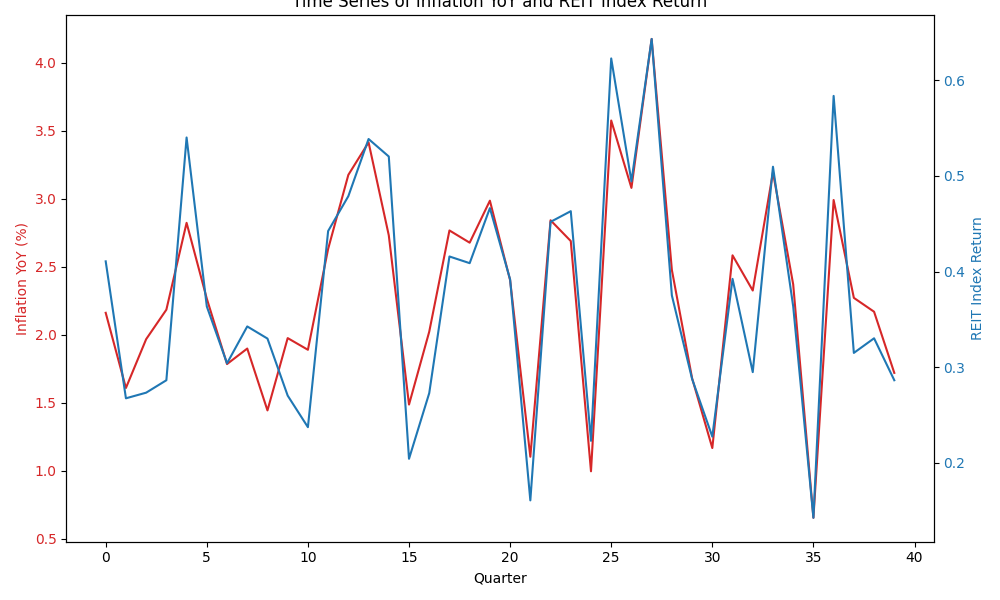
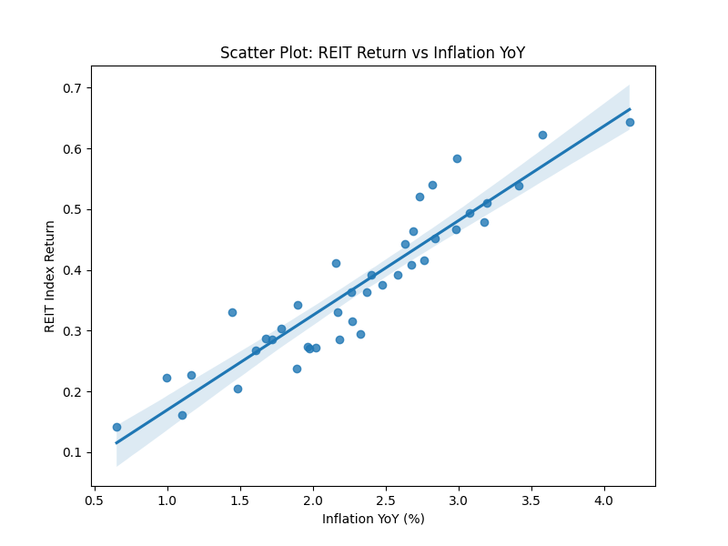
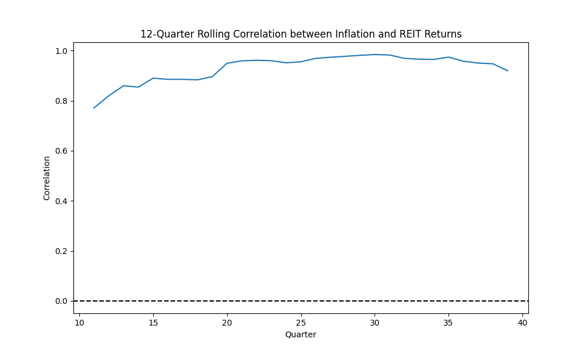

# Association Analysis of REIT Index Returns and Inflation

## 1. Introduction
Real Estate Investment Trusts (REITs) are often considered a potential hedge against inflation. Because real estate values and rental incomes tend to rise with the general price level, REIT returns may exhibit a positive association with inflation. Understanding this relationship is crucial for portfolio managers seeking inflation protection and for policymakers monitoring asset market dynamics in different macroeconomic environments. This report provides an empirical association analysis between quarterly REIT index returns and year-over-year (YoY) inflation.

## 2. Data and Methodology
The analysis utilizes a quarterly dataset (`reit_macro_quarterly.csv`) containing 40 observations of two primary variables:
*   `inflation_yoy`: Year-over-year inflation rate (%).
*   `reit_index_return`: Quarterly return of a REIT index.

The methodology proceeds in several steps:
1.  **Exploratory Data Analysis (EDA):** Visual inspection of the time series and scatter plots to identify preliminary patterns and correlations.
2.  **Stationarity Tests:** Augmented Dickey-Fuller (ADF) tests are conducted to ensure the time series are stationary, which is a prerequisite for valid regression analysis.
3.  **Regression Analysis:** Ordinary Least Squares (OLS) regression is employed to quantify the association. To account for potential autocorrelation and heteroscedasticity common in time series data, Newey-West Heteroscedasticity and Autocorrelation Consistent (HAC) standard errors are used. Both contemporaneous and lagged models are estimated to explore the timing of the relationship.
4.  **Rolling Correlation:** A 12-quarter rolling correlation is calculated to assess the stability of the relationship over time.

## 3. Results

### 3.1 Exploratory Data Analysis
The summary statistics indicate that the average YoY inflation over the sample period is 2.31%, while the average quarterly REIT index return is 0.37%. 

The time series plot above illustrates the co-movement of inflation and REIT returns. Visually, there appears to be a strong positive relationship, with REIT returns tracking the peaks and troughs of inflation quite closely.

The scatter plot further confirms this positive linear association. The unconditional Pearson correlation coefficient between the two variables is exceptionally high at 0.931.

### 3.2 Stationarity Tests
Before proceeding with regression analysis, ADF tests were performed to check for unit roots:
*   **Inflation YoY:** ADF Statistic = -5.40, p-value < 0.001
*   **REIT Index Return:** ADF Statistic = -6.07, p-value < 0.001

Both series strongly reject the null hypothesis of a unit root, indicating that they are stationary and suitable for standard regression techniques without differencing.

### 3.3 Regression Analysis

**Contemporaneous Relationship**
A contemporaneous OLS regression with HAC standard errors yields the following results:

*   **Coefficient on `inflation_yoy`:** 0.1557 (p-value < 0.001)
*   **R-squared:** 0.866

The results demonstrate a statistically significant and economically meaningful positive association. For every 1 percentage point increase in YoY inflation, the quarterly REIT index return increases by approximately 0.156 percentage points. The high R-squared indicates that inflation explains a substantial portion (86.6%) of the variance in REIT returns in this sample.

**Lagged Relationship**
To test if past inflation predicts future REIT returns, a lagged model was estimated where REIT returns are regressed on the previous quarter's inflation (`inflation_yoy_lag1`):

*   **Coefficient on `inflation_yoy_lag1`:** 0.0088 (p-value = 0.771)
*   **R-squared:** 0.003

The lagged coefficient is not statistically significant. This suggests that the relationship is primarily contemporaneous; past inflation does not provide predictive power for future REIT returns in this dataset.

### 3.4 Rolling Correlation

The 12-quarter rolling correlation plot shows that while the overall correlation is high, there is some variation over time. However, the correlation remains consistently positive and generally above 0.8 throughout the sample period, indicating a robust and stable relationship.

## 4. Discussion and Implications

**Portfolio Practice Implications:**
The strong, positive contemporaneous association between REIT returns and inflation provides empirical support for the use of REITs as an inflation hedge in investment portfolios. Investors concerned about purchasing power erosion during inflationary periods can allocate capital to REITs to potentially offset these effects. However, the lack of predictive power in the lagged model implies that investors cannot simply use last quarter's inflation to time their entry into the REIT market; the adjustment of REIT returns to inflation appears to happen concurrently.

**Policy Implications:**
For policymakers, particularly central banks, the tight coupling of real estate asset returns and general inflation highlights the transmission channels of macroeconomic conditions into asset markets. High inflation environments are likely to be accompanied by booming real estate returns, which could exacerbate wealth inequality or contribute to asset bubbles if not monitored carefully. Conversely, disinflationary policies may rapidly cool down the real estate sector.

## 5. Conclusion
This analysis finds a highly significant, positive, and stable contemporaneous association between YoY inflation and quarterly REIT index returns. The data strongly supports the narrative that REITs act as an effective hedge against inflation. However, this relationship is concurrent rather than predictive. These findings are highly relevant for portfolio construction and macroeconomic policy monitoring.