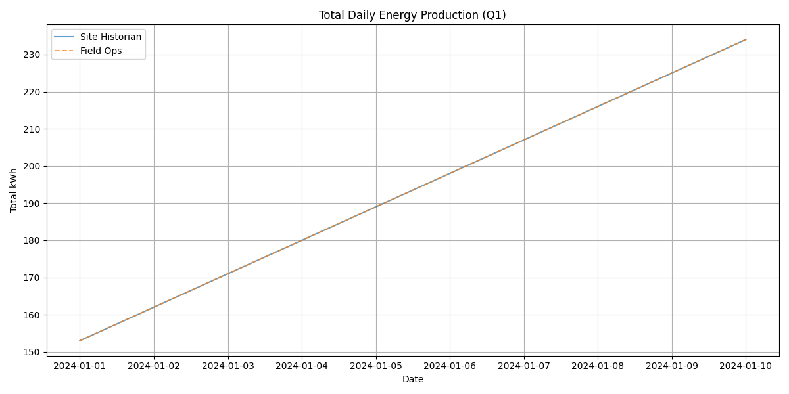
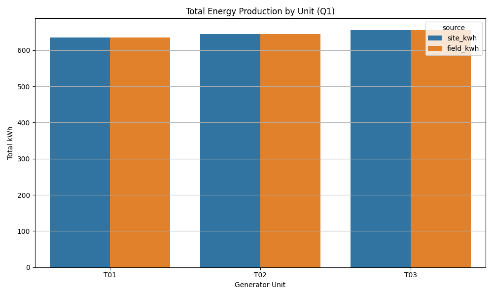
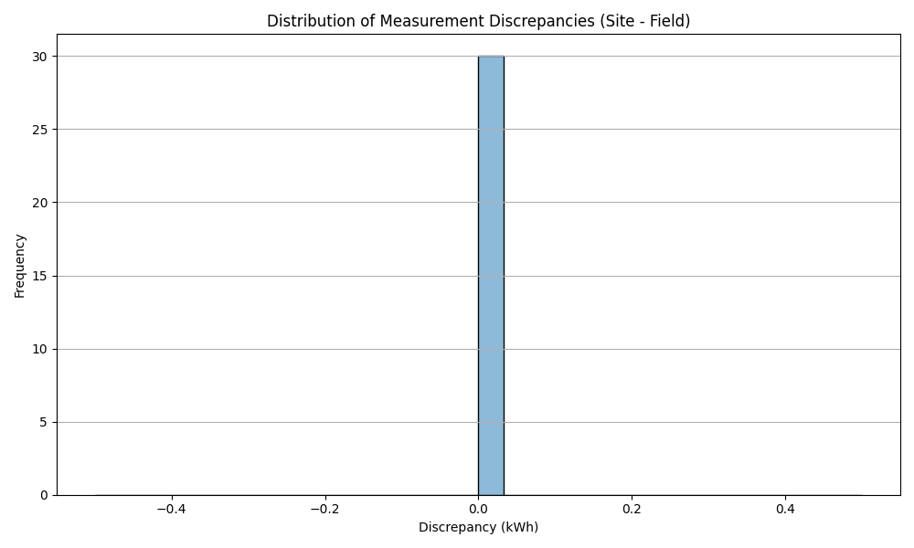

# Quarterly Operational Performance Report (Q1)

## 1. Executive Summary
This report presents a review of the operational performance of the plant's generator units for the current quarter, based on archived daily telemetry data. The analysis combines data from two independent sources: the site historian and a field laptop export. The primary objectives are to assess energy production trends, verify data integrity between the two recording systems, and provide actionable recommendations for operational optimization.

Key findings indicate a steady, linear increase in daily energy production across all three generator units (T01, T02, and T03) during the observed period. Furthermore, a data integrity check revealed perfect alignment between the site historian and valid field operations data, though minor data entry anomalies were identified in the field export.

## 2. Data Overview & Methodology
The analysis utilizes daily generator telemetry data covering the calendar window from January 1, 2024, to January 10, 2024. 

Two datasets were provided:
1. **Site Historian Export (`site_daily_kwh.csv`)**: Contains automated daily net energy production (kWh) records for each generator unit.
2. **Field Operations Export (`field_ops_export.csv`)**: Contains manual or secondary system exports of delivered energy (kWh) for the same period.

**Methodology:**
- **Data Cleaning & Standardization**: Date formats and unit identifiers (e.g., 'T-01' vs 'T01') were standardized to allow for accurate merging. Invalid date entries in the field export (e.g., missing dates, impossible dates like '13/37/2024') were identified and excluded from the comparative analysis.
- **Data Merging**: The two datasets were merged on the standardized date and unit identifier to facilitate a direct comparison.
- **Statistical Analysis**: Descriptive statistics were calculated to summarize energy production. Discrepancies between the site historian and field operations data were computed to assess data reliability.

## 3. Operational Performance

### 3.1 Total Energy Production
During the observed period, the plant demonstrated a consistent increase in daily energy production. 

*Figure 1: Total daily energy production (kWh) across all units, comparing Site Historian and Field Ops data.*

As shown in Figure 1, the total daily energy production grew steadily from 153 kWh on January 1 to 234 kWh on January 10. The overlapping lines indicate perfect agreement between the two data sources for the valid recording days.

### 3.2 Production by Generator Unit
The plant operates three generator units: T01, T02, and T03. 

*Figure 2: Total energy production (kWh) broken down by generator unit.*

Figure 2 illustrates the total energy produced by each unit over the 10-day period. 
- **Unit T03** was the highest producer, generating a total of 655 kWh.
- **Unit T02** produced 645 kWh.
- **Unit T01** produced 635 kWh.

The production levels are relatively balanced across the three units, with a slight performance edge for T03.

## 4. Data Integrity & Discrepancy Analysis
A critical component of this review is verifying the consistency between the automated site historian and the field operations export.

### 4.1 Measurement Alignment
For all valid dates within the calendar window, the energy production values recorded by the site historian perfectly matched the values in the field operations export. The calculated discrepancy (Site kWh - Field kWh) was exactly 0.0 for all 30 valid records.

*Figure 3: Distribution of measurement discrepancies between Site Historian and Field Ops.*

Figure 3 confirms that there is zero variance between the two systems for the matched records, indicating high reliability in the telemetry recording mechanisms.

### 4.2 Data Anomalies
While the matched records showed perfect alignment, the raw field operations export contained two anomalous entries that required filtering during the data cleaning phase:
1. A record with a missing date and an unusually high value (9999 kWh) for unit T-01.
2. A record with an invalid date format ('13/37/2024') and a negligible value (1 kWh) for unit T-02.

These anomalies suggest potential issues with manual data entry or edge-case bugs in the field laptop export software.

## 5. Actionable Recommendations
Based on the analysis of the Q1 telemetry data, the following actions are recommended:

1. **Investigate Field Export Anomalies**: The operations team should investigate the root cause of the invalid date entries and outlier values (e.g., 9999 kWh) in the field laptop export system. Implementing input validation or automated error checking on the field laptops will prevent these artifacts from corrupting future datasets.
2. **Monitor Unit T01 Performance**: While production is relatively balanced, Unit T01 consistently produces slightly less energy than T02 and T03. A brief maintenance inspection is recommended to ensure T01 is operating at peak efficiency and to identify any minor degradation.
3. **Automate Data Reconciliation**: Given the perfect alignment of valid records, the plant should consider automating the reconciliation process between the site historian and field exports. An automated script could flag discrepancies or anomalies (like the ones found in this report) in real-time, reducing the need for manual quarterly reviews.
4. **Expand Data Collection Window**: The current dataset only covers the first 10 days of the quarter. To provide a comprehensive quarterly review, ensure that future telemetry pulls encompass the entire 90-day period to capture long-term trends and potential seasonal variations.