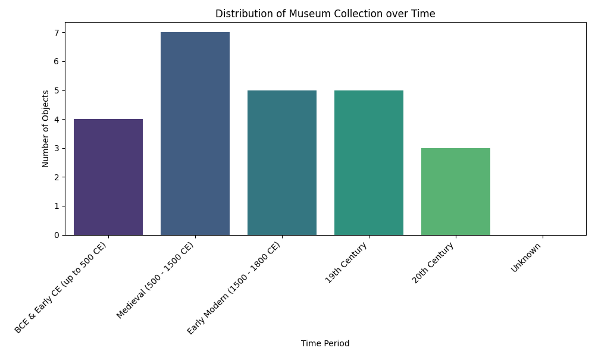

# Museum Provenance Merge Report

## 1. Introduction
This report details the process of merging and deduplicating two museum export datasets (`museum_export_a.csv` and `museum_export_b.csv`). The goal was to create a single, consolidated catalog of museum objects and to analyze the distribution of these objects across different historical time periods.

## 2. Methodology

### 2.1 Data Cleaning and Deduplication
The two datasets were first loaded and their columns were standardized to a common format (`accession`, `title`, `note`). The datasets were then concatenated. 

Several data cleaning steps were performed:
*   **Removal of Invalid Rows:** Rows with missing accession numbers or containing metadata/header information (e.g., '---', 'EXPORT_NOTE', 'FOOTER', 'TOTAL_ROWS') were removed.
*   **Accession Number Normalization:** To identify duplicate records across the two batches, accession numbers were normalized. This involved converting all characters to uppercase, removing non-alphanumeric characters (like hyphens and spaces), removing trailing 'X' characters (which appeared to be typos for duplicate entries), and stripping leading zeros from the numeric portion of the accession number. For example, 'X-100', 'X 100', 'x_100', and 'X100' were all normalized to 'X100'. 'T-088' and 'T88x' were normalized to 'T88'.
*   **Aggregation:** Records with the same normalized accession number were grouped together. The `accession`, `title`, and `note` fields for these grouped records were aggregated by joining the unique values with a pipe character (' | '). This ensures that no information from either batch is lost in the merged catalog.

### 2.2 Time Period Categorization
The aggregated `note` field for each unique object was analyzed to determine its historical time period. A rule-based approach was used, searching for specific keywords and date ranges within the notes (converted to lowercase for case-insensitive matching):

*   **BCE & Early CE (up to 500 CE):** Keywords included 'bce', 'bc', 'warring states', 'han', 'zhou'.
*   **Medieval (500 - 1500 CE):** Keywords included 'tang', 'song', 'five dynasties', '12th c', '15th c', '1400s', 'medieval', '550 ce', '618-907', '10th c'.
*   **Early Modern (1500 - 1800 CE):** Keywords included 'ming', 'qing early', 'kangxi', 'edo', '17th c', '1600s', '18th c', '1752', 'qianlong', 'wanli'.
*   **19th Century:** Keywords included '19th c', '1800s', '1880', '1890'.
*   **20th Century:** Keywords included '20th c', '1920s', '1998', 'modern'.

Objects that did not match any of these criteria were categorized as 'Unknown'.

## 3. Results

### 3.1 Deduplication Results
The initial combined dataset contained 70 valid object rows (excluding headers/footers). After normalization and deduplication, the final catalog contains **24 unique objects**. This significant reduction highlights the high degree of overlap and duplication between Batch A and Batch B, as well as within the batches themselves due to inconsistent formatting of accession numbers.

### 3.2 Time Period Distribution
The distribution of the 24 unique objects across the defined historical time periods is visualized in Figure 1.

*Figure 1: Bar chart showing the number of objects in the collection belonging to each historical time period.*

The analysis reveals that the collection spans a wide range of history, from BCE to the 20th century. The objects are relatively evenly distributed across the defined periods, with a slight concentration in the Medieval and Early Modern periods.

## 4. Conclusion
The merging process successfully consolidated the two disparate museum export files into a single, clean catalog of 24 unique items. The normalization of accession numbers was crucial for identifying duplicates that varied only in punctuation or spacing. The subsequent temporal analysis provides a clear overview of the collection's historical breadth, demonstrating that the museum holds artifacts from ancient times through to the modern era.
