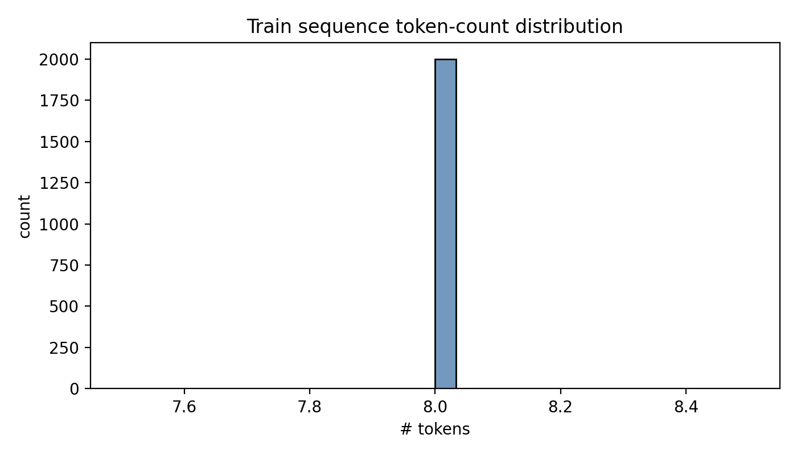
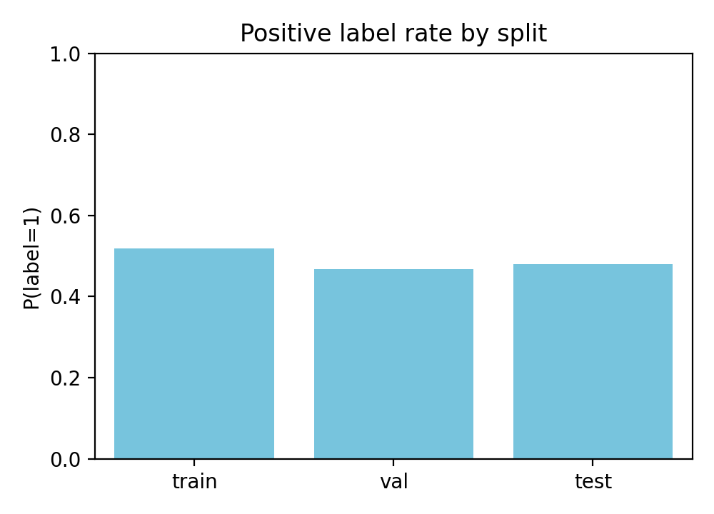

# SPR_BENCH: Benchmarking Classifiers and Estimating a Label-Noise Ceiling

## Abstract
We benchmark standard classifiers on **SPR_BENCH**, a binary classification task over fixed-length symbolic token sequences (shape+color glyphs). Using the provided fixed **train/validation/test** splits, we tune each model on validation accuracy and report **test accuracy** once. We also estimate a simple *label-noise ceiling* by measuring contradictory labels for **identical** input sequences. On this bundle, a linear SVM with token-level TF–IDF features is the strongest baseline, reaching **68.6%** test accuracy (vs. the protocol’s **70%** reference).

## 1. Data and protocol
Per `data/protocol.md`, each example is a sequence of tokens `token_0..token_{L-1}` (each token is a 2-character string like `Tr`) and a binary `label`.

### 1.1 Split sizes and class balance
From `outputs/data_overview.json`:

| Split | N | P(label=1) |
|---|---:|---:|
| Train | 2000 | 0.4920 |
| Val | 500 | 0.5280 |
| Test | 1000 | 0.5180 |

### 1.2 Basic visualization

## 2. Methods
### 2.1 Text-style representation
Although the raw data is provided as multiple columns (`token_i`), we concatenate tokens into a single whitespace-separated string feature `sequence` and apply TF–IDF:
- **Word TF–IDF**: token n-grams (1–2)
- **Char TF–IDF**: character n-grams (3–5)

### 2.2 Models and tuning
We evaluate:
- Majority-class baseline
- Logistic Regression (tuned over C)
- Linear SVM (tuned over C)
- Multinomial Naive Bayes (tuned over alpha)
- SGD logistic regression (tuned over alpha)
- MLP over TF–IDF (early stopping; small grid)

Hyperparameters are selected by **validation accuracy**. The selected configuration is retrained on **train+val** and evaluated on **test**.

### 2.3 Duplicate-contradiction label-noise ceiling
We group examples by identical `sequence` and compute the error rate of an oracle that predicts the **majority label per unique sequence**. This yields a lower bound on irreducible error caused by label noise/ambiguity that manifests as *duplicate inputs with conflicting labels*.

## 3. Results
### 3.1 Validation-selected test accuracy

The complete model table (generated from `outputs/results_table.csv`) is:

| Model                 | Params                                | Val acc | Test acc |
|----------------------|----------------------------------------|---------|----------|
| LinearSVM_TFIDF_word | {"C": 0.5}                            | 71.40%  | 68.60%   |
| LinearSVM_TFIDF_char | {"C": 1.0}                            | 70.80%  | 68.10%   |
| LogReg_TFIDF_char    | {"C": 1.0}                            | 70.40%  | 67.80%   |
| LogReg_TFIDF_word    | {"C": 0.5}                            | 69.80%  | 67.20%   |
| SGDLog_TFIDF_word    | {"alpha": 0.0003}                     | 67.80%  | 65.80%   |
| MultinomialNB_TFIDF_word | {"alpha": 0.1}                    | 67.20%  | 65.60%   |
| MLP_TFIDF_word       | {"alpha": 0.0001, "hidden": [128]}   | 64.80%  | 63.50%   |
| Majority             | {}                                     | 52.80%  | 51.80%   |

(Also saved as `outputs/accuracy_table.md`.)

**Best model.** `outputs/best_model.json` identifies the best validation-selected model as **LinearSVM_TFIDF_word** with `C=0.5`, achieving **68.6%** test accuracy.

**Comparison to the reference.** The protocol’s stated SOTA reference is **70%**. On this bundle and split, our best baseline is **68.6%** (≈ **−1.4** percentage points).

**Best-model confusion matrix.**

A full per-class classification report is saved at `outputs/classification_report_best.txt` (and mirrored in `report/classification_report.md`).

### 3.2 Label-noise ceiling from identical-input contradictions

Split-wise diagnostic (from `outputs/label_noise_ceiling.json`):

| Split | N | Unique seq | Conflicting unique | LB error | Ceiling |
|---|---:|---:|---:|---:|---:|
| train | 2000 | 1989 | 10 | 0.6000% | 99.4000% |
| val | 500 | 500 | 0 | 0.0000% | 100.0000% |
| test | 1000 | 1000 | 0 | 0.0000% | 100.0000% |
| all | 3500 | 3487 | 12 | 0.6286% | 99.3714% |

Interpretation: the duplicate-contradiction rate is **very low**, so this diagnostic does **not** support label-noise-as-ceiling as an explanation for the remaining error (~31%). Performance limits are more consistent with a need for models that capture longer-range/compositional structure beyond local n-grams.

## 4. Discussion
- **Linear TF–IDF baselines are strong but not SOTA on this bundle.** LinearSVM/LogReg are competitive and clearly outperform the majority baseline, but fall slightly below the protocol’s 70% reference.
- **The “noise ceiling” measured via duplicates is near 100%.** Contradictory labels for identical sequences are rare, so this type of label noise is unlikely to be the dominant bottleneck.
- **Next steps.** Models that more directly encode symbolic constraints (e.g., structured sequence models or learned rule representations) may better close the gap.

## 5. Reproducibility
- Code: `code/run_spr_bench.py`
- Outputs: `outputs/` (tables, best-model JSON, ceiling JSON)
- Figures: `report/images/` (PNG)
