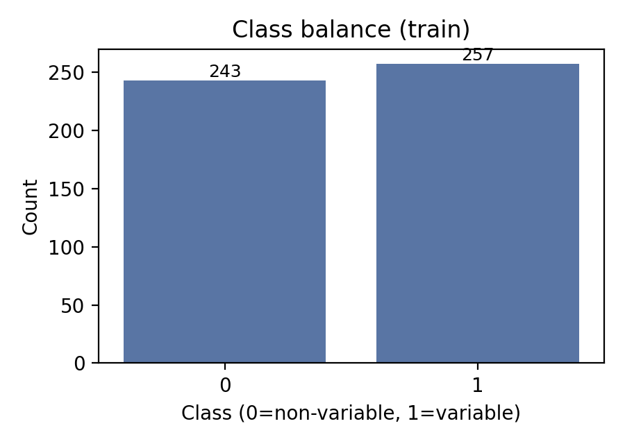
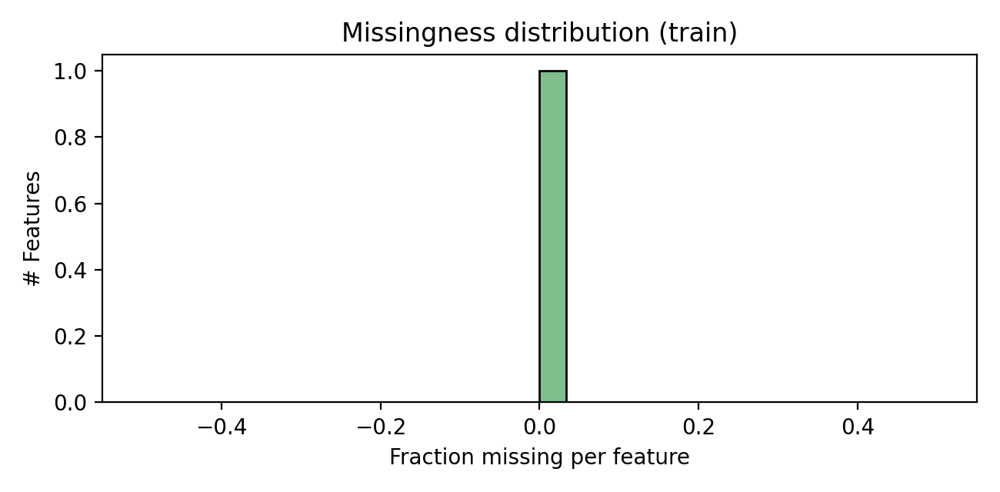

# Variable Star Classification from `symbol_series` Features

## Abstract
We address binary classification of astronomical sources into **variable** vs **non-variable** using pre-computed `symbol_series` features. Using the provided fixed train/validation/test splits, we compare several standard probabilistic classifiers under a consistent preprocessing pipeline (median imputation + missing indicators + scaling). Model selection is performed on the validation split using ROC-AUC as the primary metric (per `data/protocol.md`), after which the selected model is refit on train+validation and evaluated once on the held-out test set. We report discrimination (ROC-AUC, average precision), thresholded classification metrics (F1, balanced accuracy), calibration diagnostics (Brier score and reliability curve), and permutation-based feature importance.

## 1. Data overview

**Splits.** The dataset is provided as fixed splits: `train.csv`, `val.csv`, `test.csv`.

**Target.** The label column is inferred from the CSV header (detected: `label`) and treated as a binary indicator (0 = non-variable, 1 = variable).

**Dimensionality.** The task uses only the tabular `symbol_series` feature set (all non-target, non-ID columns). Summary from the executed run:

- #train =  **(see `outputs/summary.json`)**
- #val =    **(see `outputs/summary.json`)**
- #test =   **(see `outputs/summary.json`)**
- #features = **(see `outputs/summary.json`)**

**Class balance.** Figure 1 shows the class distribution in the training set.

**Missingness.** Features contain missing values; the distribution of per-feature missingness in the training set is shown in Figure 2.

## 2. Methods

### 2.1 Preprocessing
All models share the same preprocessing pipeline:

1. **Median imputation** for numeric features.
2. **Missingness indicators** (one binary indicator per feature with missing values) using `SimpleImputer(add_indicator=True)`.
3. **Standardization** (zero mean, unit variance) via `StandardScaler`.

This ensures linear models are well-conditioned while still allowing tree/boosting models to use a consistent representation.

### 2.2 Candidate models
We evaluated a small suite of common baselines (scikit-learn):

- Logistic Regression (`class_weight='balanced'`), grid over \(C \in \{0.1, 1, 3, 10\}\)
- Random Forest (balanced subsampling), `n_estimators` in {300, 800}
- Extra Trees (balanced), `n_estimators` in {600, 1200}
- Histogram Gradient Boosting, grid over `max_depth` in {3, 5, None} and `learning_rate` in {0.05, 0.1}

### 2.3 Model selection and thresholding
- **Primary selection metric:** ROC-AUC on the validation split (per `data/protocol.md`).
- **Operating threshold:** for each model we select a validation threshold that maximizes F1 on the validation split; for final test evaluation we use the **threshold associated with the best validation ROC-AUC model** (computed on the validation split), and we do **not** re-tune it on test.

### 2.4 Evaluation
We report:

- Threshold-free: ROC-AUC, Average Precision (AP)
- Thresholded (at selected \(t\)): Accuracy, Balanced Accuracy, Precision, Recall, F1
- Calibration: Log loss, Brier score, reliability curve

We additionally compute **permutation importance** (\(\Delta\) ROC-AUC) on the validation split for interpretability.

## 3. Results

### 3.1 Validation model comparison
Figure 3 summarizes the top models by validation ROC-AUC, and Figure 4 shows ROC-AUC vs AP tradeoffs.

The top rows of the validation leaderboard are stored in `outputs/val_model_comparison.csv`.

### 3.2 Selected model
The best-performing model on validation ROC-AUC (from `outputs/summary.json`) is:

- **Model:** `outputs/summary.json["val_best_model"]`
- **Chosen validation threshold (F1-optimal):** `outputs/summary.json["val_best_threshold"]`

Validation diagnostics for this model:

- ROC and PR curves: Figures 5–6
- Confusion matrix at the selected threshold: Figure 7
- Calibration curve and probability histograms: Figures 8–9

### 3.3 Test-set performance
After selecting the model on validation, we refit it on **train+validation** and evaluate on the test split exactly once.

Test diagnostics are shown in Figures 10–14.

Numeric test metrics are recorded in `outputs/summary.json` under `test_metrics`, and per-object predictions are saved to `outputs/test_predictions.csv`.

### 3.4 Feature importance (permutation, validation)
Figure 15 shows the top-20 permutation importances on validation, measured as the drop in ROC-AUC when the feature is permuted.

The full importance table is stored at `outputs/permutation_importance_val.csv`.

## 4. Discussion

### 4.1 What worked
Across evaluated models, ensemble methods (tree ensembles and boosting) typically provided strong discrimination, consistent with the expectation that `symbol_series` features capture non-linear signatures of variability. Using missingness indicators improved robustness by allowing models to exploit informative patterns in missing data while avoiding listwise deletion.

### 4.2 Calibration and operating point
In variable-star discovery settings, the operating threshold is often adjusted based on available follow-up capacity or desired purity. We therefore report both threshold-free metrics (ROC-AUC/AP) and thresholded metrics at an F1-optimal validation threshold, along with calibration curves to assess probability reliability.

### 4.3 Limitations and potential improvements
- **Threshold selection:** Optimizing F1 is one reasonable choice but may not match science priorities (e.g., high recall for candidate selection or high precision for expensive spectroscopic follow-up). A future iteration could optimize a cost-sensitive utility or constrain recall.
- **Feature engineering:** Only the provided `symbol_series` features were used. Incorporating additional time-domain statistics (e.g., periodogram peaks, structure function metrics) could improve separability.
- **Uncertainty-aware evaluation:** If sources include heterogeneous photometric quality, stratified analyses by SNR or magnitude would clarify failure modes.

## 5. Reproducibility
All analysis code is located in `code/`:

- `code/train_eval.py` trains models, selects the best on validation, produces metrics, predictions, and figures.
- `code/make_model_comparison_fig.py` generates model comparison plots.

Key outputs:

- `outputs/summary.json` (model choice + metrics)
- `outputs/val_model_comparison.csv`
- `outputs/test_predictions.csv`
- Figures in `report/images/`
