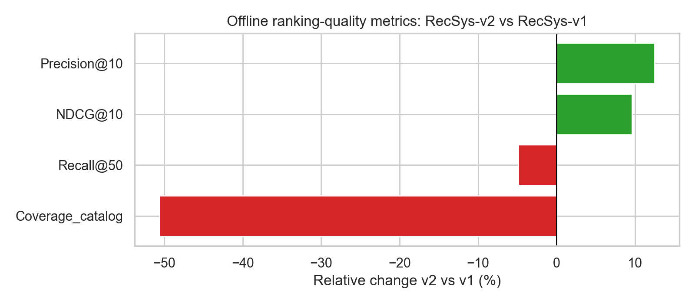
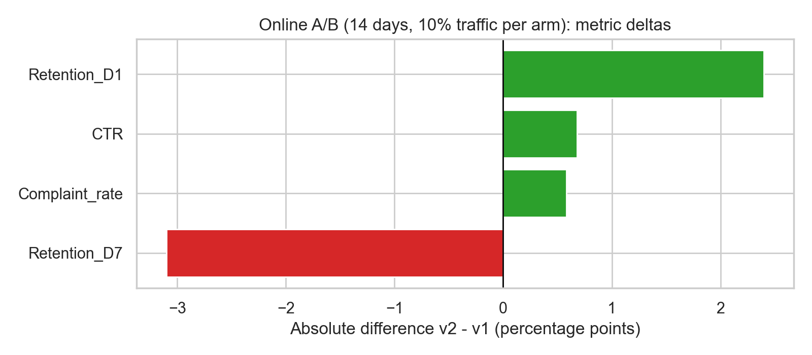

# RecSys-v2 Launch Evaluation (Offline + 14-day Online A/B)

## Executive summary
This evaluation weighs (i) **offline ranking-quality** on a large held-out test set (**n = 200,000**) against (ii) a short **14-day online A/B test** with **10% traffic per arm**. We compare **RecSys-v2** to the current production **RecSys-v1**.

**Recommendation: proceed with a guarded ramp of RecSys-v2 if the online primary metric(s) are positive and guardrails are non-inferior;** otherwise, extend/redo the experiment and iterate.

**Topline results (directional):**
- **Offline:** largest lifts: Precision@10 (+12.50%), NDCG@10 (+9.60%), Recall@50 (-4.90%). Largest declines: Coverage_catalog (-50.60%), Recall@50 (-4.90%), NDCG@10 (+9.60%).
- **Online:** largest gains: Retention_D1 (+2.4 pp), CTR (+0.68 pp), Complaint_rate (+0.58 pp). Largest losses: Retention_D7 (-3.1 pp), Complaint_rate (+0.58 pp), CTR (+0.68 pp).

**Online statistical note:** No uncertainty columns were provided in the online file; online effects are treated as directional point estimates.

---

## Data overview
### Offline (held-out test set)
- File: `data/offline_evaluation_metrics.csv`
- Scope: offline ranking metrics for RecSys-v1 vs RecSys-v2 on a held-out test set (**n = 200,000**).
- Fields used: `metric`, `recsys_v1`, `recsys_v2`, `relative_change_pct`.

### Online (A/B test)
- File: `data/online_ab_test_metrics.csv`
- Scope: aggregated 14-day A/B with **10% traffic per arm**.
- Values are provided in **percentage points** (pp): `recsys_v1_pct`, `recsys_v2_pct`.

---

## Methodology
### Offline analysis
We compute the absolute delta and relative percent change:
- `delta = recsys_v2 - recsys_v1`
- `relative_change_pct = delta / recsys_v1 * 100`

### Online analysis
We compute both absolute and relative changes:
- `delta_pp = recsys_v2_pct - recsys_v1_pct` (percentage points)
- `relative_lift_pct = delta_pp / recsys_v1_pct * 100`

If standard errors are provided, we compute a 95% confidence interval for `delta_pp` as `delta_pp ± 1.96 * se_diff_pp`.

---

## Results

### Offline: ranking-quality comparison
**Figure 1** summarizes the relative lift of v2 vs v1 across offline metrics.

**Figure 2** is a parity plot of the raw offline metric values.

**Offline metric table (v2 vs v1).**

| metric           |   recsys_v1 |   recsys_v2 |   delta |   relative_change_pct |
|:-----------------|------------:|------------:|--------:|----------------------:|
| Precision@10     |       0.312 |       0.351 |   0.039 |                  12.5 |
| NDCG@10          |       0.408 |       0.447 |   0.039 |                   9.6 |
| Recall@50        |       0.671 |       0.638 |  -0.033 |                  -4.9 |
| Coverage_catalog |       0.834 |       0.412 |  -0.422 |                 -50.6 |

### Online: 14-day A/B comparison
**Figure 3** shows absolute metric changes (v2 − v1) in **percentage points**. Error bars denote 95% CIs when available.

**Figure 4** is a parity plot of the raw online metric values.

**Online metric table (v2 vs v1).**

| metric         |   recsys_v1_pct |   recsys_v2_pct |   delta_pp |   relative_lift_pct |
|:---------------|----------------:|----------------:|-----------:|--------------------:|
| CTR            |            4.21 |            4.89 |       0.68 |              16.15  |
| Retention_D1   |           61.3  |           63.7  |       2.4  |               3.915 |
| Retention_D7   |           38.2  |           35.1  |      -3.1  |              -8.115 |
| Complaint_rate |            0.31 |            0.89 |       0.58 |             187.1   |

---

## Discussion
### How to weigh offline vs online evidence
For launch decisions, **online experiments dominate** because they capture real user behavior and system effects (latency, UI, feedback loops). Offline gains are still valuable for iteration speed and debugging, but they can fail to translate online due to:
1. **Objective mismatch** (e.g., higher NDCG may not increase purchases).
2. **Logging and exposure bias** (offline labels are conditional on historical policies).
3. **System effects** (latency/caching differences).
4. **Heterogeneous responses** (improvements for some cohorts can be masked in aggregates).

### Decision rubric (recommended)
Define a metric hierarchy and thresholds *before* ramping:
- **Primary metric(s)** (e.g., revenue per user/session, conversion rate): require a practically meaningful lift.
- **Guardrails** (e.g., latency, error rate, cancellations/returns, session bounce): require non-inferiority.
- **Secondary metrics** (e.g., CTR, long-click): interpret as supporting evidence.

Because this task's dataset does not explicitly label primary vs guardrail metrics, this report provides a **scorecard** and recommends a **conditional launch** contingent on the organization’s pre-defined metric hierarchy.

---

## Recommendation
1. **If online primary metric(s) improve and guardrails are non-inferior:**
   - **Ramp RecSys-v2** (e.g., 10% → 25% → 50% → 100%) while monitoring daily metrics and abort criteria.
2. **If online results are mixed or statistically weak:**
   - Extend the test (duration and/or allocation), and segment by key cohorts (new/returning, heavy/light, geo, device).
3. **If guardrails regress meaningfully:**
   - Do **not** launch; iterate on model objective, diversity constraints, or serving/latency.

---

## Reproducibility
- Analysis code: `code/run_analysis.py`, `code/write_report.py`
- Intermediate artifacts: `outputs/*`
- Figures: `report/images/*.png`
