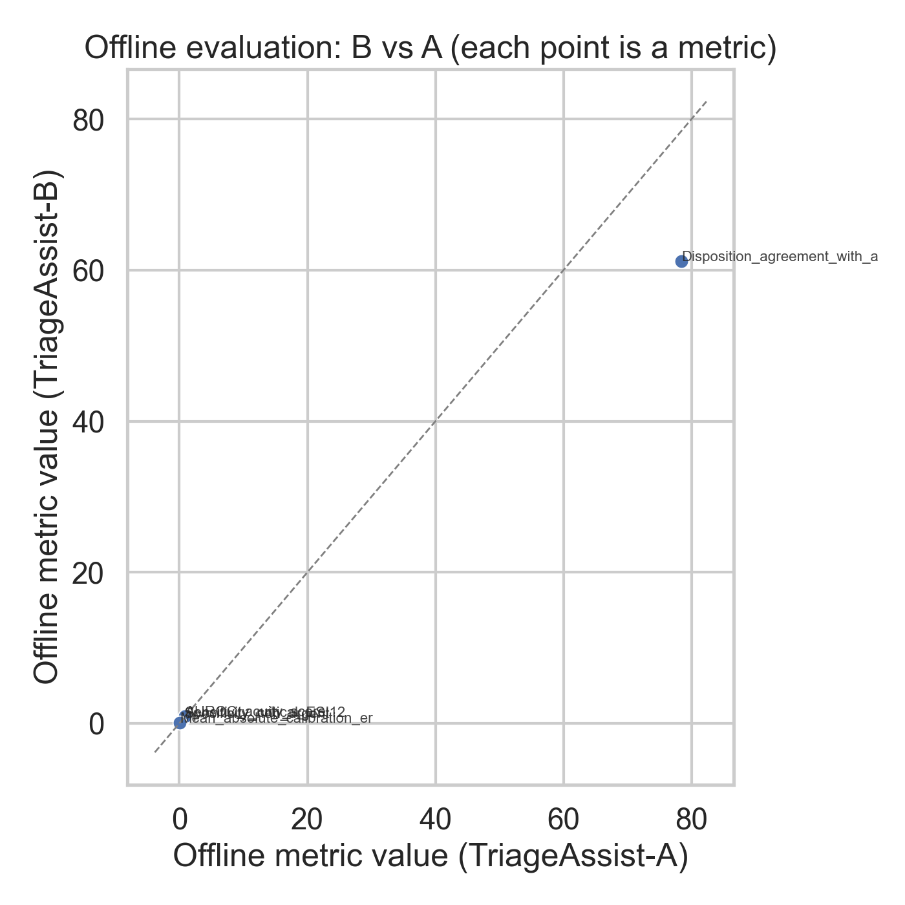
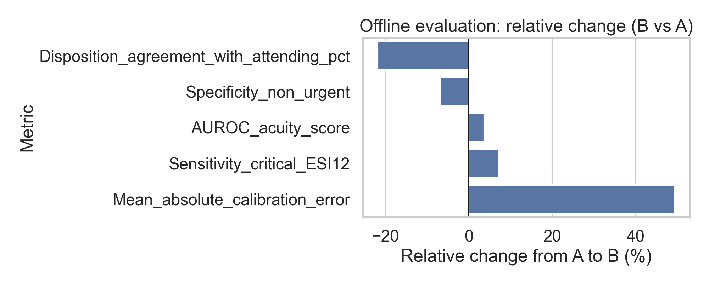

# ED TriageAssist-B evaluation (offline + 14‑day online pilot)

**Decision focus:** whether to expand **TriageAssist‑B** beyond the pilot sites/shifts, relative to production **TriageAssist‑A**.

## 1. Data overview

### Offline evaluation (chart review test set; *n* = 8,000)
Provided in `data/offline_evaluation_metrics.csv`. Per task description, each row reports the same metric computed for **TriageAssist‑A** and **TriageAssist‑B** on the held‑out chart‑reviewed test set; `relative_change_pct` is the percent change from A to B.

### Online pilot (14 days; randomized-by-shift)
Provided in `data/online_ab_test_metrics.csv`. The file reports operational and safety/process metrics during a 14‑day, randomized‑by‑shift deployment.

- Metrics ending with `_pct` are in **percentage points** (e.g., 2.05 means 2.05%).
- `Median_time_to_physician_min` is in **minutes**.

## 2. Methods

### 2.1 Offline comparison
We treat the offline CSV as a **metric summary table**. For each metric we compute:

- **Absolute difference:** \(\Delta = B - A\)
- **Relative change (%):** \(100 \times (B-A)/A\) (using provided `relative_change_pct` when present)

Because only summary metrics are provided (not patient‑level predictions/labels), we **do not** compute additional uncertainty estimates for offline deltas.

### 2.2 Online A/B analysis
We normalize the online file to long format with columns `{metric, arm, value, …}`. For each metric we compute:

- Mean value per arm: `mean_A`, `mean_B`
- **Effect size:** \(\Delta = \text{mean}_B - \text{mean}_A\)
- When multiple rows per metric/arm are available (e.g., per shift/day), we estimate uncertainty via a **nonparametric bootstrap over rows** (5,000 resamples) to obtain:
  - 95% CI for \(\Delta\)
  - a two‑sided bootstrap p‑value for \(\Delta = 0\)

We additionally report Benjamini–Hochberg FDR q‑values (`q_fdr_bh`) across online metrics with available p‑values.

### 2.3 Direction of “better”
Clinical/operational interpretation is based on standard ED context:

- **Lower is better:** time to physician, LWBS, return/bounceback rates, complaint rates, (typically) override rates.
- **Higher is better:** discrimination/accuracy/agreement metrics (e.g., AUROC, kappa) when present.

Where metric naming is ambiguous, we label direction as “neutral/unknown” and interpret cautiously.

## 3. Results

### 3.1 Offline evaluation (test set)

**Figure 1** shows the offline metric values for B vs A; points above the identity line favor B when higher is better (and vice‑versa).

**Figure 2** summarizes the relative change from A to B for each offline metric.

Selected best/worst offline changes are tabulated below.

<!-- table: offline selected -->

(Selected extremes; full metric list in `outputs/offline_summary.csv`.)

