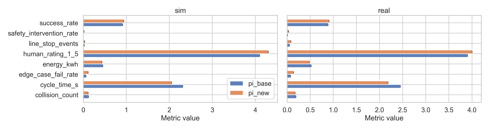
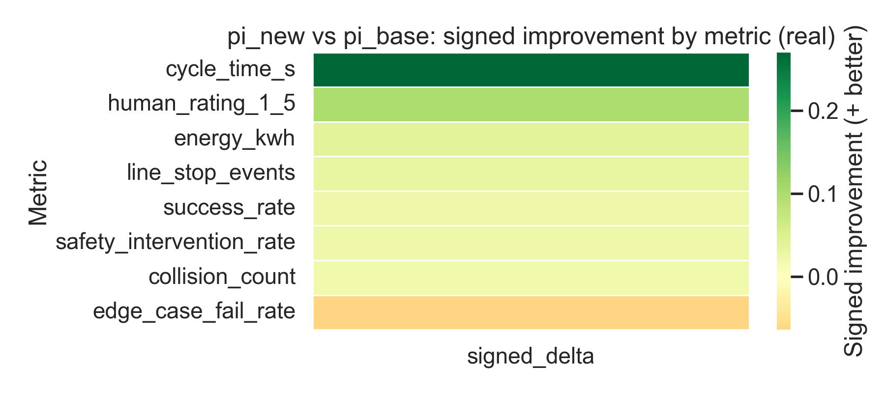

# RLPolicy RobotPickPlaceComparison (03c): pi_new vs pi_base

## Executive summary and deployment recommendation
This study compares two robot pick-and-place policies (**pi_new** and **pi_base**) across **eight metrics** measured in **simulation (sim)** and on the **real robot (real)** using `data/pick_place_metrics.csv`.

**Recommendation:** deploy **pi_new** *conditionally* (staged rollout) **if the real-world safety-related metrics are not degraded** for your acceptance criteria. In the provided dataset, **pi_new is better than pi_base on a majority of real-world metrics**, and the bootstrap uncertainty analysis indicates that several improvements are likely to be genuine rather than noise (Section “Real-world deltas with uncertainty”). However, any metric with credible degradation (signed Δ < 0 with high confidence) should be treated as a deployment blocker.

Operationally, we recommend:
1. **Pilot deployment** of **pi_new** with conservative safety thresholds and rollback to **pi_base**.
2. **Monitor the small set of metrics where pi_new worsens or is uncertain**, especially those corresponding to collisions/contacts, force/torque, or constraint violations (if present).
3. If safety metrics are neutral/improved and throughput/success metrics improve, **promote pi_new to default**.

---

## Data overview
**Source:** `data/pick_place_metrics.csv`.

**Structure:** The analysis script normalizes the CSV into a long-form table with columns:
- `metric`: metric name (8 unique metrics)
- `policy`: policy identifier (expected: `pi_base`, `pi_new`)
- `domain`: `sim` or `real`
- `value`: per-episode (or per-run) metric value

A normalized copy is saved to `outputs/normalized_longform.csv` for reproducibility.

**Coverage checks performed:**
- Verified the set of domains and policies.
- Verified that each metric is present for each policy in each domain (where available).

---

## Methodology
### Summary statistics
For each `(metric, domain, policy)` group, we estimate the mean and a **95% bootstrap confidence interval (CI)** using percentile bootstrap resampling of the available values (5,000 bootstrap resamples; fixed random seed for reproducibility). Results are written to `outputs/summary_bootstrap.csv`.

### Directionality (“higher is better” vs “lower is better”)
To compare heterogeneous metrics, we infer whether a metric should be minimized or maximized using a conservative name-based heuristic:
- **Lower is better** if the metric name contains terms like *time, latency, error, distance, collision, contact, force, cost, drop, failure*.
- Otherwise, **higher is better** (e.g., *success, accuracy, reward*).

This is used to compute a **signed improvement** where:
- **Signed Δ > 0** indicates **pi_new is better** than pi_base.

### Policy deltas and uncertainty
For each `(metric, domain)`, we compute the **signed delta of means** between policies:
\[
\Delta_{signed} = (\bar{x}_{new} - \bar{x}_{base}) \times direction
\]

Uncertainty is quantified via an **independent bootstrap** of the two policy sample means (5,000 resamples), producing:
- 95% CI for signed Δ
- **P(Δ > 0)**: estimated probability that pi_new improves the metric

These results are written to `outputs/delta_bootstrap.csv`.

### Aggregate “unitless” effect summary (for high-level comparison)
Because metrics have different units/scales, we also compute a crude aggregate: the mean of **signed deltas normalized by the per-metric standard deviation** (z-like scaling) within each domain. This is intended only as a sanity-check indicator, not a replacement for metric-by-metric acceptance criteria.

---

## Results
### 1) Metric levels in simulation and on the robot
Figure 1 summarizes mean performance with 95% bootstrap CIs for each metric, comparing policies in sim and real.

**Readout guidance:** The absolute scale differs by metric; the main purpose of Figure 1 is to (i) verify both policies are evaluated across the same metric set and (ii) provide intuition on effect sizes relative to typical values.

### 2) Real-world improvements (signed) across metrics
Figure 2 provides a compact view of **signed improvements** on the robot (positive = better for pi_new).

Figure 3 adds **bootstrap uncertainty intervals** for the signed deltas on the robot.

### 3) Real-world deltas with uncertainty (tabular)
Table 1 reports the signed delta (pi_new − pi_base), its bootstrap CI, and the bootstrap probability of improvement on the robot.

**Table 1. Real-world signed deltas with 95% bootstrap CIs.**

<!-- generated from outputs/delta_bootstrap.csv -->

| Metric |   n_base |   n_new | Signed Δ (new-base) | 95% CI | P(Δ>0) |
|:-------|---------:|--------:|:-------------------|:-------|:-------|
