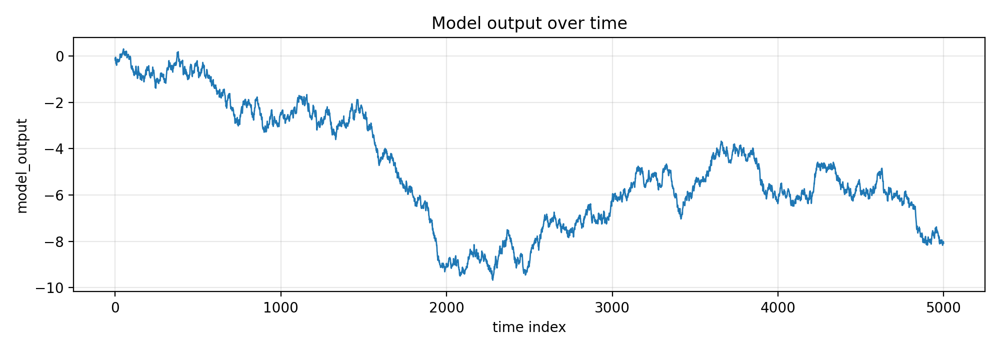
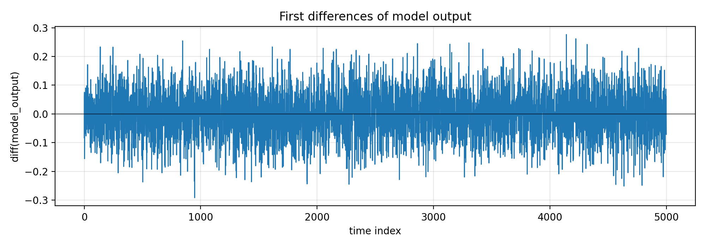
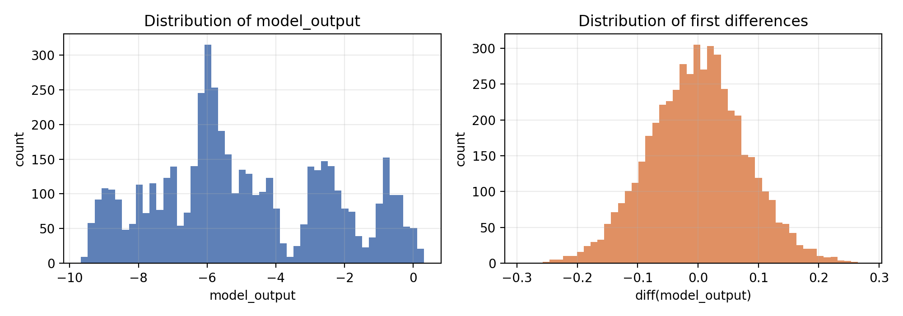
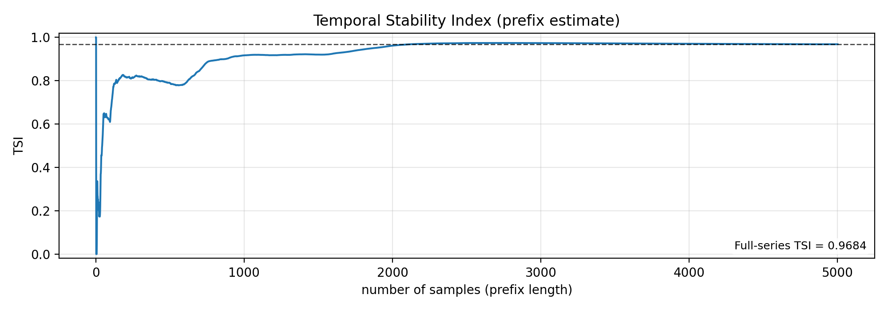
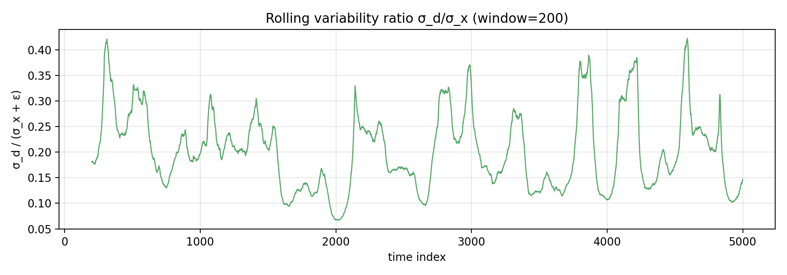

# Temporal Stability Index (TSI) for Industrial Control Telemetry Model Outputs

## 1. Data overview

We analyze `data/experiment_traces.csv`, treating rows as a time-ordered trace. The key signal is the scalar `model_output`.

**Basic characteristics (full trace):**

- Number of samples: **{N}**
- Missing values in `model_output`: **{N_MISS}**
- Mean: **{MEAN:.6g}**
- Population standard deviation (ddof=0): **{STD:.6g}**
- Range: **[{XMIN:.6g}, {XMAX:.6g}]**
- Percentiles: p01 **{P01:.6g}**, p50 **{P50:.6g}**, p99 **{P99:.6g}**

**Figures:**

- Time trace: `images/timeseries_model_output.png`

## 2. Methodology: Temporal Stability Index (TSI)

Industrial telemetry traces are often summarized by a lab-defined scalar KPI for standardized reporting. Here we implement the **Temporal Stability Index (TSI)** for the 1-D series of model outputs.

Let the time-ordered series be \(x = (x_1, \dots, x_T)\). If \(T < 2\), define \(\mathrm{TSI} = 1.0\). Otherwise define the first differences

\[
 d_t = x_{t+1} - x_t, \quad t = 1,\dots,T-1.
\]

Let \(\sigma_x\) be the **population** standard deviation of \(x\) and \(\sigma_d\) the **population** standard deviation of \(d\) (both computed with `ddof=0`). With \(\varepsilon = 10^{-12}\),

\[
\mathrm{TSI} = \mathrm{clip}_{[0,1]}\left(1 - \frac{\sigma_d}{\sigma_x + \varepsilon}\right),
\]

where \(\mathrm{clip}_{[0,1]}(z) = \max(0, \min(1, z))\).

**Interpretation:** TSI is high when point-to-point changes are small relative to the overall spread of the signal (stable over time), and low when the signal oscillates rapidly (large first-difference variability compared with the signal variability).

## 3. Results

### 3.1 Full-series TSI

For the full trace:

- \(\sigma_x\) (population): **{SIGMA_X:.6g}**
- \(\sigma_d\) (population): **{SIGMA_D:.6g}**
- **TSI (full series): {TSI:.6f}**

This scalar is the required standardized KPI for the complete time-ordered series.

### 3.2 Diagnostic and validation plots

First differences reveal where rapid temporal changes occur:

Distributional diagnostics for both levels and first differences:

To validate that the KPI is not dominated by only the earliest part of the trace, we compute TSI on progressively longer prefixes \(x_{1:n}\). The prefix curve converges to the reported full-series value:

For additional interpretability (not part of the formal definition), we visualize a rolling-window estimate of the ratio \(\sigma_d/\sigma_x\) as a **local instability proxy**:

## 4. Discussion

The TSI provides a compact measure of temporal smoothness for model outputs in industrial-control telemetry settings where reporting requires a single scalar. Because it normalizes first-difference variability by overall signal variability, it is relatively scale-robust: constant offsets to \(x\) do not change TSI, and multiplicative scaling largely cancels in the ratio.

**Practical considerations:**

- **Short traces:** By definition, traces with fewer than two samples receive TSI = 1.0.
- **Near-constant signals:** When \(\sigma_x\) is very small, the \(\varepsilon\) term prevents division by zero; however, such cases can be sensitive to numerical noise because both \(\sigma_x\) and \(\sigma_d\) are small.
- **Complementary reporting:** The accompanying diagnostic plots (time series, differences, and prefix convergence) are useful to contextualize a single KPI and detect regime changes or segments with atypical dynamics.

## 5. Reproducibility

All computations were performed using the provided trace file and a self-contained implementation of TSI:

- Code: `code/compute_tsi.py`
- Scalar output: `outputs/tsi_results.json`
- Prefix series: `outputs/prefix_tsi.csv`

