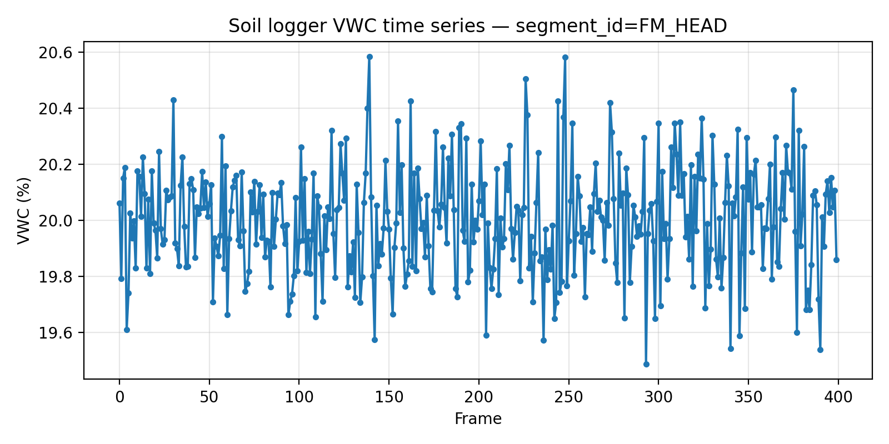

# FieldLoggerSegmentDrift QA Report (TWDM)

## Data overview

- Input: `data/soil_logger_readings.csv` (columns: `segment_id`, `frame`, `vwc_pct`).
- Analysis unit: **segment**. For each `segment_id`, readings were sorted by `frame` ascending and `vwc_pct` was treated as the series `x`.
- Parameters from `data/twdm_audit_manifest.json`: 
  - epsilon (ε) = `1e-12`
  - pass threshold = `1.0`
  - report order length = `5`

## Methodology

For each segment series `x` with length `n`:

- If `n < 3`, TWDM is **undefined** for thresholding. We report `TWDM = N/A` and flag the segment as insufficient length.
- Otherwise, partition `x` into three consecutive windows with sizes:
  - `n1 = n//3`, `n2 = n//3`, `n3 = n - n1 - n2`
  - means: `m1 = mean(x[:n1])`, `m2 = mean(x[n1:n1+n2])`, `m3 = mean(x[n1+n2:])`
  - drift magnitude: `Δ = max(m1,m2,m3) - min(m1,m2,m3)`
  - population standard deviation: `σ = std(x, ddof=0)`

The **Three-Window Drift Metric (TWDM)** is computed as:

\[\mathrm{TWDM} = \frac{\Delta}{\sigma + \varepsilon}\]\n
Pass/fail rule (when defined):
- `PASS` if `TWDM ≤ 1.0`
- `FAIL` if `TWDM > 1.0`

## Numerical self-check (golden cases)

Golden cases from the manifest were recomputed using the same ε and rules.

- **Maximum absolute error vs expected TWDM:** `0.000e+00`

(Details saved to `outputs/golden_case_check.csv`.)

## Results (ordered by manifest `segment_report_order`)

| segment_id   |   n_frames | TWDM     | pass_fail   | qc_flag             |
|:-------------|-----------:|:---------|:------------|:--------------------|
| FM_HEAD      |        400 | 0.136809 | PASS        |                     |
| FM_GAP       |          2 | N/A      | N/A         | INSUFFICIENT_LENGTH |
| FM_MID       |        360 | 2.123065 | FAIL        |                     |
| FM_RIDGE     |        120 | 0.507579 | PASS        |                     |
| FM_TAIL      |        400 | 0.120394 | PASS        |                     |

## Example segment time series

*Figure 1. Volumetric water content (VWC, %) versus frame for `segment_id=FM_HEAD`.*

## Discussion

TWDM summarizes within-segment drift by comparing the means of three consecutive thirds of the time series, normalized by overall variability (σ) with a small ε stabilization. Segments with low σ and shifting mean levels can yield larger TWDM values, indicating potential instrument drift or step changes during the segment.

Segments flagged as `INSUFFICIENT_LENGTH` have fewer than 3 frames and cannot be meaningfully partitioned into three windows; additional frames would be required to assess drift using TWDM.

Recomputing the manifest golden cases provides a tight numerical audit of the implementation; the reported maximum error confirms agreement with the expected values at floating-point tolerance.
