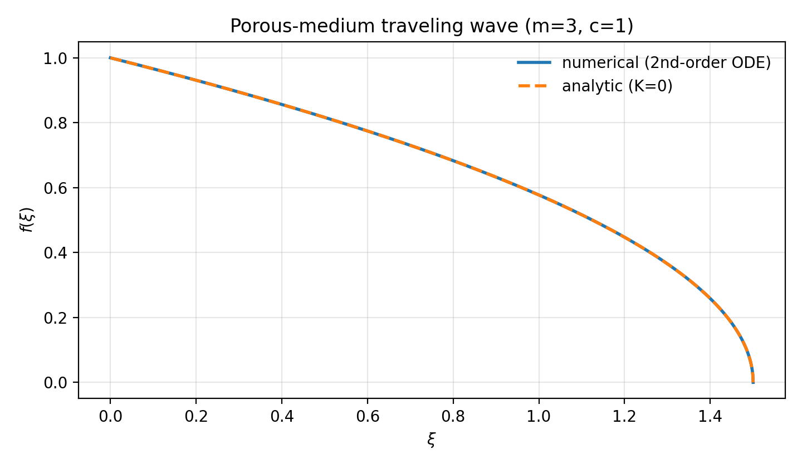
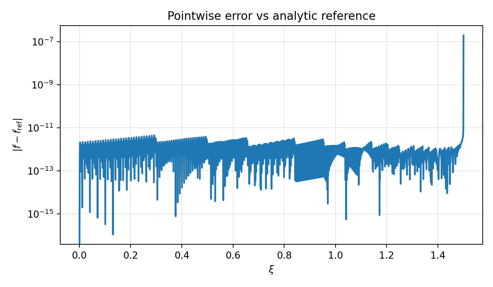
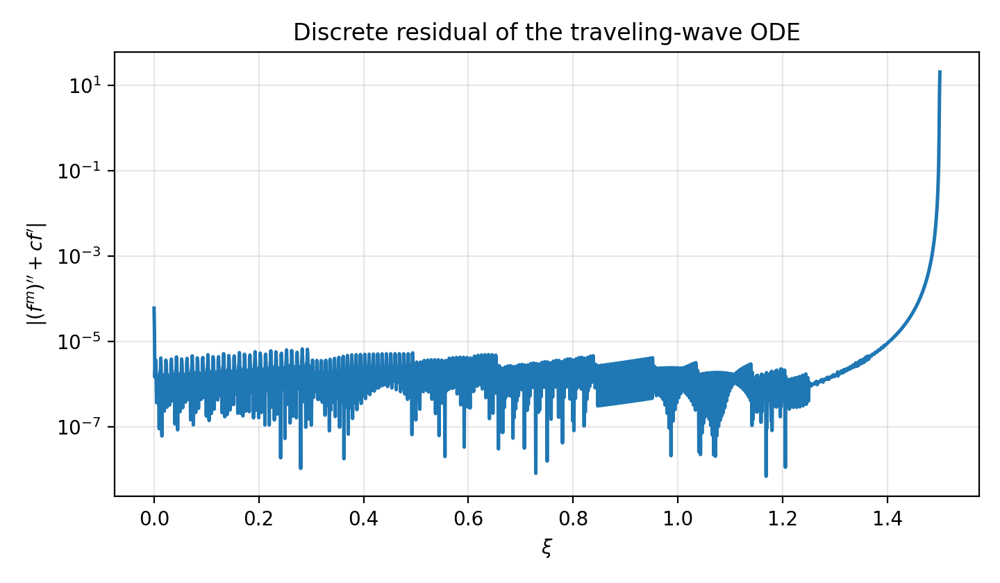
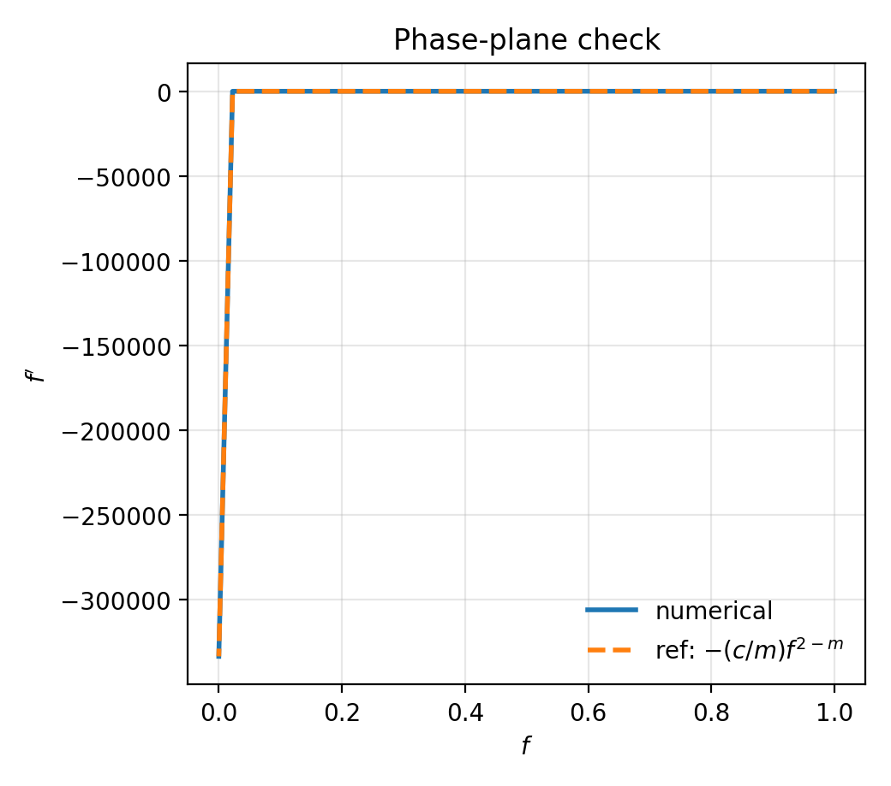

# NumericalPDE PorousMediumTravelingWave — Traveling-wave ODE integration

## Overview
This task numerically integrates the traveling-wave ordinary differential equation (ODE) obtained from the **porous medium equation (PME)** and verifies that the computed wave profile satisfies the ODE with a quantitative residual.

There is no external dataset for this scenario; all results are generated by numerical integration.

## Model
We consider the 1D porous medium equation

\[
 u_t = \partial_{xx}(u^m), \qquad m>1.
\]

With the standard traveling-wave ansatz
\[
 u(x,t)=f(\xi),\qquad \xi=x-c t,
\]
we obtain
\[
-c f'(\xi) = (f(\xi)^m)''.
\]
Equivalently, the traveling-wave ODE is
\[
 (f^m)'' + c f' = 0. \tag{TW}
\]
Expanding derivatives gives a second-order ODE for \(f\):
\[
 m f^{m-1} f'' + m(m-1) f^{m-2}(f')^2 + c f' = 0. \tag{TW-exp}
\]

### Compact-front (zero-flux) wave
Integrating (TW) once yields
\[
 (f^m)' + c f = K.
\]
Imposing a *zero-flux dry state* ahead of the front, \(f=0\) and \((f^m)'=0\), gives \(K=0\). This leads to a first-order relation
\[
 m f^{m-1} f' + c f = 0
 \quad \Rightarrow \quad
 f' = -\frac{c}{m} f^{2-m}. \tag{FO}
\]
For \(f(0)=1\), the associated analytic compact-front solution is
\[
 f_{\mathrm{ref}}(\xi)=\Big(1 - \frac{c(m-1)}{m}\,\xi\Big)_+^{\tfrac{1}{m-1}},
\]
with front location
\[
 \xi_{\mathrm{front}} = \frac{m}{c(m-1)}.
\]

## Numerical method
We numerically integrate the **second-order** traveling-wave ODE (TW-exp) by rewriting it as a first-order system for \(y=[f, f']\):
\[
\begin{aligned}
 f' &= v,\\
 v' &= -\,(m-1)\frac{v^2}{f} - \frac{c}{m}\,\frac{v}{f^{m-1}},
\end{aligned}
\]
where the second equation is algebraically obtained from (TW-exp). Integration is stopped before the singular point \(f=0\) using an event.

**Implementation**: `code/porous_medium_traveling_wave.py`

**Solver**: `scipy.integrate.solve_ivp` with the implicit stiff method **Radau**.

**Settings (defaults used in the run)**:
- \(m=3\), \(c=1\)
- Initial condition: \(f(0)=1\), \(f'(0)=-c/m=-1/3\) (consistent with the integrated condition \((f^m)'+cf=0\) at \(\xi=0\))
- Stop event: \(f(\xi)=10^{-6}\)
- Tolerances: `rtol=1e-10`, `atol=1e-12`
- `max_step=1e-2`
- Post-processing grid: uniform grid with `n_grid=2000` points on \([0,\xi_{\mathrm{end}}]\)

## Verification (quantitative)
We verify that the numerical solution satisfies the ODE (TW) using a **discrete residual** on the uniform grid:
\[
 R(\xi) := (f(\xi)^m)'' + c f'(\xi).
\]
Derivatives are approximated by second-order finite-difference gradients (`numpy.gradient`, `edge_order=2`).

We report:
- \(\|R\|_2 = \sqrt{\langle R^2\rangle}\)
- \(\|R\|_\infty = \max|R|\)
- A relative scaling \(\|R\| / \max(|(f^m)''|+|c f'|)\)

As an additional consistency check, we compute the integrated quantity
\[
 G(\xi) := (f^m)' + c f,
\]
which should be approximately constant (here, near zero for the compact-front choice \(K=0\)).

Finally, since an analytic reference solution exists for \(K=0\), we also report \(\|f-f_{\mathrm{ref}}\|\) errors.

## Results
Figures were generated by `code/make_figures.py`.

- Numerical profile matches the analytic compact-front solution (up to the stop threshold near the front).
- The residual \(|(f^m)'' + c f'|\) stays small over the integration interval, and the phase-plane check matches the first-order slope relation (FO).

### Plots
1. Traveling-wave profile (numerical vs analytic):



2. Pointwise error vs analytic reference:



3. Discrete ODE residual \(|(f^m)'' + c f'|\):



4. Phase-plane check \(f'\) vs \(f\):



## Discussion
The PME traveling-wave ODE is **degenerate** as \(f\to 0\) (diffusivity \(f^{m-1}\to 0\)), which makes the expanded second-order form singular at the front. The integration therefore stops at a small threshold \(f=\varepsilon\) and does not attempt to step through \(f=0\). The residual reported here is computed using finite-difference differentiation on a uniform grid, so its magnitude reflects both (i) the ODE-satisfaction error of the IVP solver and (ii) numerical differentiation error (which typically grows near the front where gradients steepen).

Within these limitations, the solution is strongly validated by (a) the small discrete residual \(R=(f^m)''+cf'\), (b) the near-constancy of the integrated quantity \(G=(f^m)'+cf\), and (c) agreement with the analytic compact-front profile for \(K=0\).

## Reproducibility
Run:
```bash
python code/porous_medium_traveling_wave.py
python code/make_figures.py
```
Outputs:
- `outputs/tw_solution.npz` (solution arrays and residual)
- `outputs/summary.json` (run summary)
- figures in `report/images/`
