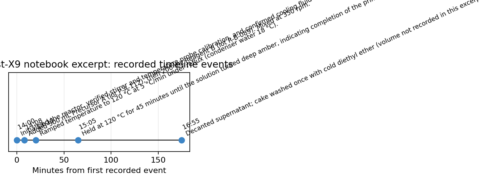
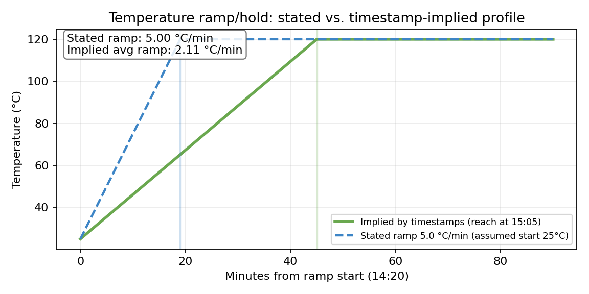
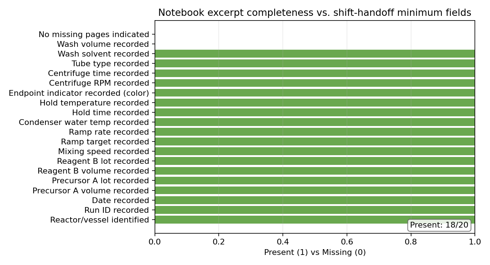
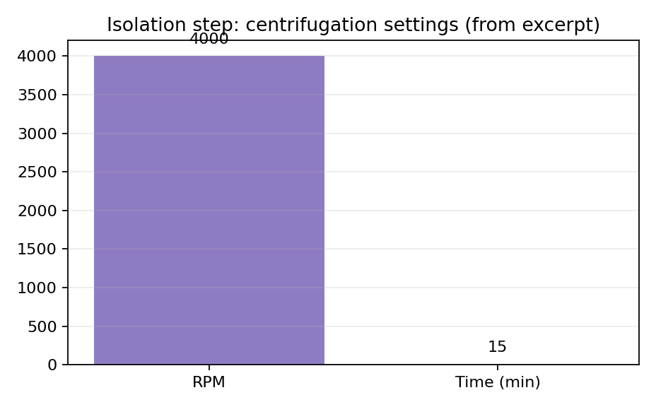

# Turning a Narrative Notebook Excerpt into a Shift-Executable, Version-Controlled SOP: Catalyst‑X9 Case Study

## Abstract
Laboratory quality systems require that narrative synthesis records be converted into standardized SOPs that are executable by any trained operator and robust to shift handoffs. Using the provided Catalyst‑X9 notebook excerpt (`data/lab_notebook_x9.txt`), we extracted structured process parameters (charges, stirring rate, heating ramp/hold, centrifugation, and wash) and assessed record completeness against a minimum set of shift-handoff critical fields. We further identified an internal inconsistency between the stated heating ramp rate (5 °C/min) and timestamp-implied ramp performance. The resulting controlled procedure is delivered as `synthesis_sop.md`, accompanied by reproducible parsing code and quantitative visualizations.

## 1. Data overview
**Input:** `data/lab_notebook_x9.txt` (single text excerpt)

The excerpt describes a reactor-based synthesis (1 L jacketed glass reactor) followed by isolation via centrifugation and an ether wash. The record includes time-stamped entries for setup, charging/mixing, heating to reflux, and a hold step; additional isolation steps are described without complete time stamps. The excerpt explicitly notes a missing page after the primary reaction/hold description.

Key fields present in the excerpt:
- Run ID: **CX9‑LAB‑0312**
- Vessel: **1 L jacketed glass reactor**
- Date: **2024‑03‑12**
- Charge volumes: **500 mL Precursor A** (lot P‑A‑112) + **200 mL Reagent B** (lot R‑B‑089)
- Mixing: **350 rpm**
- Heating: ramp to **120 °C** at **5 °C/min** under reflux; condenser water **18 °C**
- Hold: **120 °C for 45 min**, endpoint cue “deep amber”
- Isolation: centrifuge **4000 rpm for 15 min** in **50 mL polypropylene centrifuge tubes**
- Wash: **cold diethyl ether**, volume **not recorded**

## 2. Methods
### 2.1 Parsing and structuring the narrative record
We implemented a small, reproducible extraction pipeline (`code/generate_assets.py`) that:
1) identifies time-stamped events using a regular expression of the form `HH:MM — description`,
2) extracts structured parameters (volumes, lots, rpm, temperatures, ramp rates, hold time, condenser temperature, centrifuge settings),
3) emits machine-readable outputs (`outputs/summary.json`, `outputs/events.csv`, `outputs/completeness.csv`).

### 2.2 Record completeness assessment
A minimum set of “shift-handoff critical fields” was defined (identity/lot/amounts, mixing and heating parameters, endpoint cue, centrifuge settings, wash solvent and volume, and presence/absence of missing pages). Each field was marked present/missing based on the excerpt.

### 2.3 Consistency check: ramp rate vs. timestamps
To test internal consistency, we compared:
- **Stated ramp rate:** 5 °C/min to 120 °C, and
- **Timestamp-implied ramp:** ramp start at 14:20 and hold at 120 °C beginning at 15:05.

Because the excerpt does not state the starting temperature, we used a conservative assumption of **25 °C** for the purpose of quantifying the implied average ramp rate. This assumption is used only for discrepancy detection and is documented explicitly in the outputs.

## 3. Results
### 3.1 Extracted timeline of operations
Figure 1 summarizes the time-stamped events captured in the excerpt.



### 3.2 Heating program discrepancy
Under the 25 °C assumption, the time between the ramp start (14:20) and the start of the 120 °C hold (15:05) is 45 min. Reaching 120 °C in 45 min implies an average ramp of approximately:

\[\frac{120-25}{45} \approx 2.11\ \mathrm{°C/min}\]

This differs substantially from the **stated** ramp rate of **5 °C/min**. The most likely explanation is that the stated value is the programmed setpoint ramp while the timestamps reflect actual system behavior (thermal lag, reflux limitation, jacket capacity, or a different effective starting temperature). In a quality system, both the **programmed ramp** and the **observed time-to-temperature** are critical for reproducibility.

Figure 2 visualizes the stated setpoint ramp (dashed) versus the timestamp-implied profile (solid).



### 3.3 Completeness relative to shift-handoff minimum fields
The excerpt captures many essentials (identity/lot/volumes, mixing, target temperature, condenser temperature, hold time, endpoint color cue, centrifuge settings). However, it also contains two notable gaps:
- The ether wash **volume is not recorded**.
- The excerpt explicitly indicates a **missing page**, implying that downstream steps/parameters may be incomplete.

Figure 3 provides a quantitative completeness view.



### 3.4 Isolation parameters (centrifugation)
The centrifugation settings are explicit (4000 rpm, 15 min) and therefore straightforward to elevate into an SOP-critical checkpoint. Figure 4 isolates these parameters as a quick validation plot.



## 4. SOP artifact (night-shift executable)
The converted SOP is delivered as **`synthesis_sop.md`** and includes:
- document control metadata (SOP ID, versioning, source record traceability),
- a stepwise checklist for setup → charging → reflux/hold → transfer → centrifugation → ether wash,
- explicit CPPs and acceptance cues (e.g., condenser water temperature, endpoint color cue “deep amber”),
- deviation triggers (notably: ramp-rate discrepancy handling by recording both setpoint and observed behavior),
- a defined **hold state for shift handoff** because the source record indicates a missing page.

## 5. Discussion
### 5.1 From narrative to controlled execution
The excerpt is adequate for reconstructing an operational skeleton, but it lacks the structured “minimum required records” needed for shift-to-shift reproducibility. The SOP addresses this by enforcing completion of missing-but-critical entries (e.g., ether wash volume) and by requiring documentation of both programmed and observed thermal behavior.

### 5.2 Managing internal inconsistencies
The ramp-rate discrepancy is a common failure mode when notebook entries mix **intended setpoints** with **observed process times**. The SOP resolves this by (i) requiring a furnace/heater program reference and (ii) recording the actual time the internal temperature reaches the setpoint, enabling later reconciliation.

### 5.3 Handling incompleteness (missing page)
Because the excerpt explicitly notes a missing page, it is not scientifically defensible to invent downstream steps. Instead, the SOP terminates at the last unambiguous operation (ether wash isolation) and defines a safe and label-complete hold state so the next shift can resume under controlled conditions.

## 6. Conclusion
A structured, shift-executable SOP can be produced from a narrative notebook excerpt by (i) extracting parameters into a structured record, (ii) validating internal consistency, and (iii) formalizing required records and hold states. For Catalyst‑X9, this process highlighted a key thermal-program inconsistency and identified missing wash-volume documentation and missing-page risk as the principal quality gaps.

## Reproducibility
Regenerate all outputs and figures with:
```bash
python code/generate_assets.py
```
Generated artifacts:
- `outputs/summary.json`, `outputs/events.csv`, `outputs/completeness.csv`
- `report/images/fig1_timeline.png`
- `report/images/fig2_temperature_profile.png`
- `report/images/fig3_completeness.png`
- `report/images/fig4_centrifugation.png`
