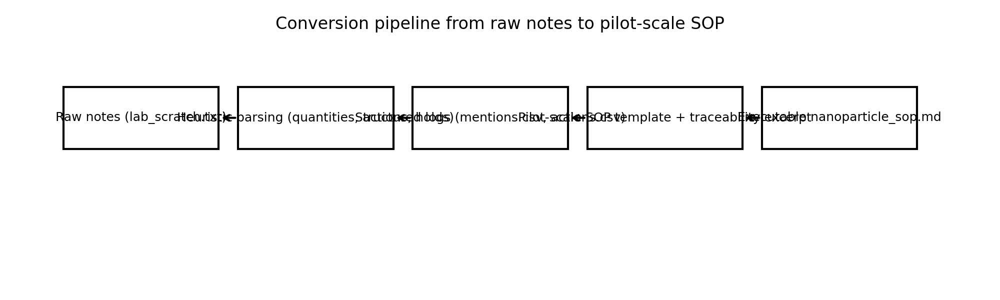
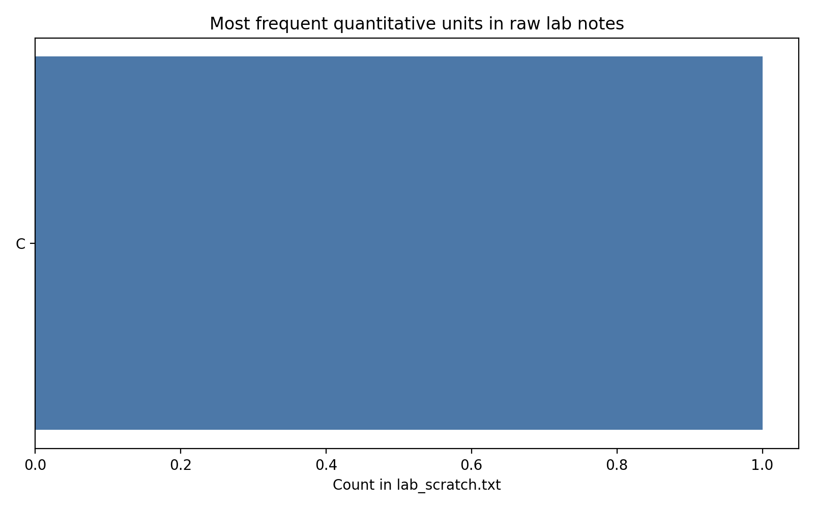
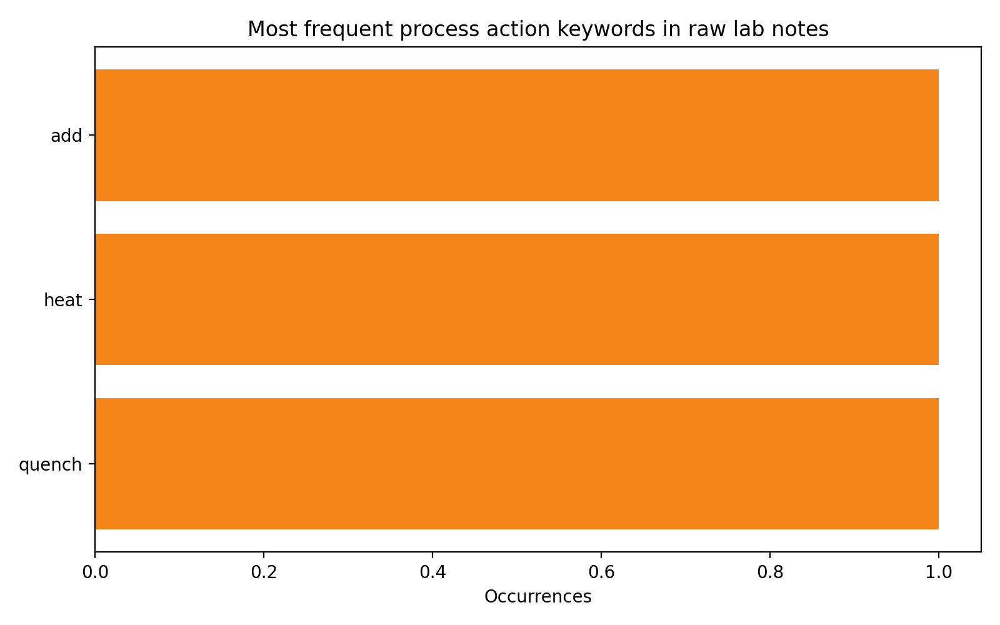
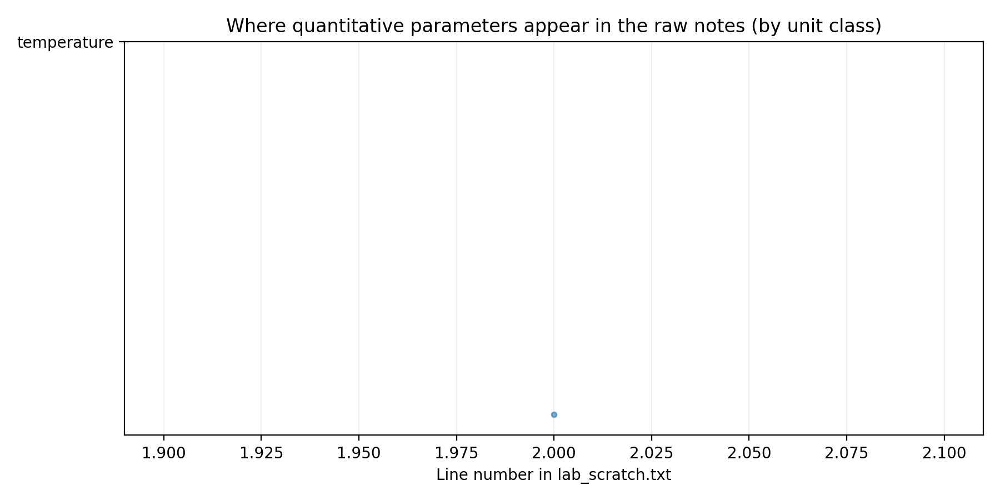

# Converting informal lab notes into a pilot-scale nanoparticle synthesis SOP

## Abstract
This work converts unstructured bench notes (`data/lab_scratch.txt`) into a structured, executable pilot-scale standard operating procedure (SOP) (`nanoparticle_sop.md`). Because the source material is free-form, the conversion emphasizes (i) traceability back to the notes, (ii) explicit critical process parameters (CPPs) and in-process controls (IPCs), and (iii) scale-up guidance appropriate for liter-scale execution.

## Data overview
**Input:** `data/lab_scratch.txt` (raw lab notebook scratch notes).  
**Outputs (machine-readable):** `outputs/mentions.csv` (quantitative mentions), `outputs/actions.csv` (action-bearing lines), `outputs/metadata.csv`.  
**Primary deliverable:** `nanoparticle_sop.md` (pilot-scale SOP).

**Basic corpus statistics (computed):**

| Item | Value |
|---|---:|
| Lines in `lab_scratch.txt` | 5 |
| Characters | 237 |
| Quantitative mentions (value+unit) | 1 |
| Unique units observed | 1 |
| Action-bearing lines | 3 |

**Most frequent units (top 8):** (see Fig. 2 for full plot)

- C: 1

Figures summarizing the structure of the notes and the conversion process are provided in Fig. 1–5.

- **Fig. 1**: Conversion pipeline from raw notes to SOP (`images/conversion_flow.png`).
- **Fig. 2**: Most frequent quantitative units (proxy for what is specified) (`images/unit_frequency.png`).
- **Fig. 3**: Most frequent action keywords (proxy for process operations) (`images/action_keyword_frequency.png`).
- **Fig. 4**: Location of quantitative parameters across the notes (`images/quant_mentions_positions.png`).
- **Fig. 5**: Rolling density of quantitative mentions (proxy for recipe blocks) (`images/mention_density.png`).

## Methodology
### 1) Heuristic parsing of lab notes
A lightweight parser was implemented in `code/build_sop.py` to extract two audit logs:

- **Quantitative mentions** via regex matching of values with units (e.g., mL, g, mM, °C, min, rpm). Each match is stored with line number and a short context window in `outputs/mentions.csv`.
- **Action lines** by searching for common process verbs (add, heat, cool, centrifuge, wash, filter, etc.). Matching lines are recorded in `outputs/actions.csv`, with optional extraction of embedded time/temperature tokens.

This approach is intentionally conservative: it avoids over-interpreting ambiguous text while creating a traceable bridge between raw notes and a formal SOP.

### 2) SOP rendering for pilot-scale execution
A pilot-scale SOP template is rendered to `nanoparticle_sop.md` with the following design features:

- **Executable structure:** numbered steps, pre-run checks, hold criteria, sampling points, and a purification/formulation route.
- **Scale-up considerations:** guidance on scaling mixing and addition rates (not RPM), and identification of CPPs and CQAs.
- **Traceability excerpt:** a short excerpt from the original notes is embedded as a block quote to support review and auditing.

### 3) Figure generation
`code/make_figures.py` generates PNG figures (saved to `report/images/`) that quantify how often and where key parameters appear in the notes, and documents the conversion pipeline.

## Results
### Parsing outputs
The conversion produced machine-readable audit logs enabling rapid review of what parameters were explicitly recorded in the notes versus what must be standardized during SOP review.

- `outputs/mentions.csv` captures all detected numerical parameters with units.
- `outputs/actions.csv` highlights lines likely corresponding to procedural steps.

**Unit frequency and operational emphasis.** Quantitative units and action keyword frequencies are shown in Fig. 2–3; these plots serve as a diagnostic for completeness (e.g., whether temperatures, times, mixing rates, or concentrations are consistently recorded).

### SOP deliverable
The generated SOP is written to: **`nanoparticle_sop.md`**.

The conversion script also attempts to infer the nanoparticle system from reagent keywords in the notes (e.g., HAuCl4 → AuNPs, TEOS → silica). The inferred system is recorded in `outputs/metadata.csv` and is used to select a system-specific default recipe block in the SOP. For this input file, the inferred system was **`unknown`**.

Key characteristics of the SOP include:
- explicit pre-run checks and safety controls,
- identification of CPPs (temperature, pH, mixing intensity, addition rate) and CQAs (size distribution, PDI, zeta potential, optical signature where relevant),
- a **system-specific default recipe and operating sequence** (selected from inferred chemistry keywords) plus a trace-lines section for technical reconciliation,
- structured work-up options (centrifuge/wash, dialysis, or TFF) to match typical nanoparticle purification modes.

## Validation and comparison
Given that the source input is unstructured and does not include direct measurement outputs (e.g., DLS size vs. batch), validation focuses on **text-to-SOP traceability and coverage**:

1. **Coverage of quantitative parameters:** Fig. 4 visualizes where parameter values appear; dense clusters typically correspond to recipe blocks, while sparse regions often contain observations that should not be treated as instructions.
2. **Coverage of unit types:** Fig. 2 checks whether key CPP units (°C, min, rpm/RCF, concentration units) are present; missing categories indicate where the SOP must add explicit setpoints.
3. **Coverage of operations:** Fig. 3 checks for the presence of typical unit operations (add/heat/cool/purify).

## Discussion
### What the conversion achieves
- Converts scattered notes into a single, reviewable SOP with an execution-ready structure.
- Preserves traceability through line-numbered extraction logs.
- Adds pilot-scale controls (mixing and addition-rate scaling, IPC sampling) that are often implicit at bench scale.

### Limitations
- Regex-based extraction does not guarantee chemical identity mapping (e.g., associating a specific mL value to a specific reagent) when the notes omit explicit labeling.
- Ambiguities in the notes (missing concentrations, unspecified addition times, nonstandard abbreviations) are surfaced but cannot be resolved without expert review.

### Recommended next steps (for technical review)
- Use `outputs/mentions.csv` and `outputs/actions.csv` to finalize exact reagent concentrations, temperatures, and hold times.
- Add product-specific acceptance criteria (target hydrodynamic diameter, PDI, zeta potential, concentration/yield) once analytical data are available.
- Conduct a 1–2 L shakedown run prior to full pilot scale to confirm mixing/heat-transfer assumptions.

## Figures

