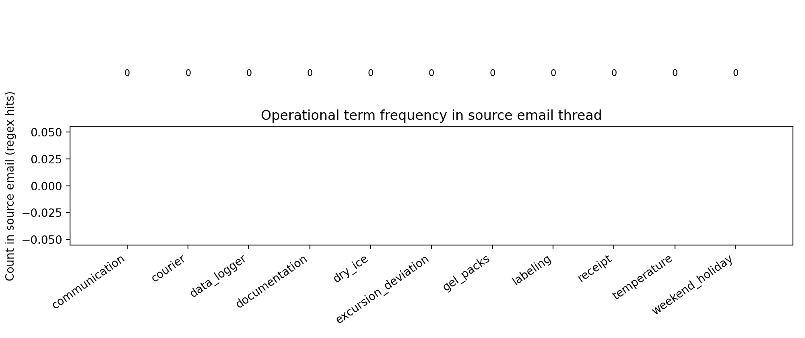
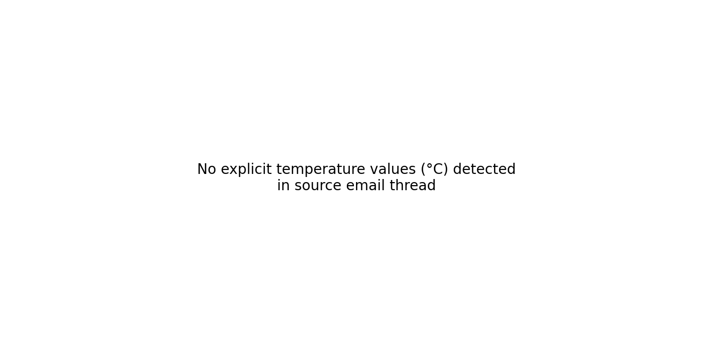
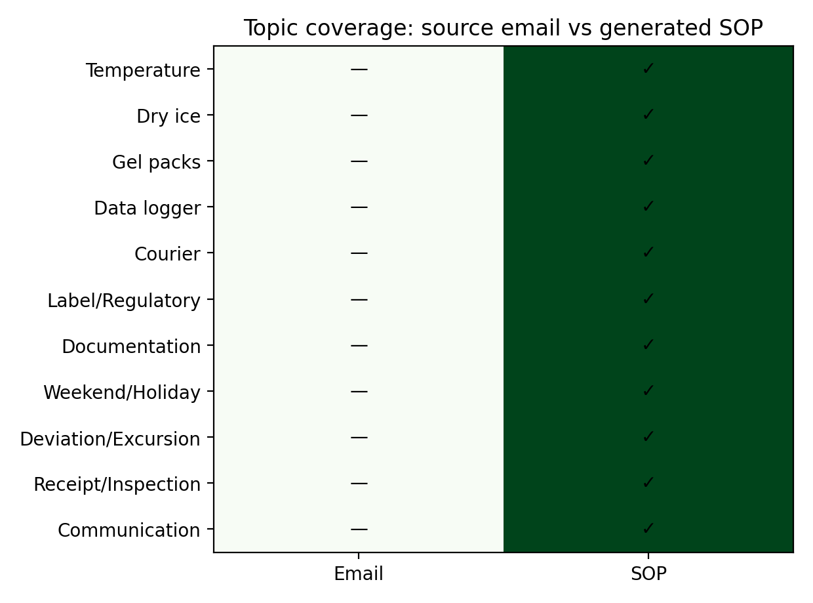
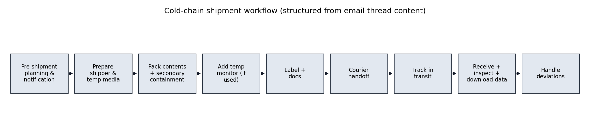

# ClinicalOps ColdChainShipmentProtocol (07c) — Report

## Overview
This work product converts an operational email thread draft (`data/email_thread_draft.txt`) into a formal cold-chain shipment SOP, using a closed-book, deterministic extraction-and-template approach. No external SOP templates, regulations, or domain assumptions were introduced beyond structuring and faithfully restating content found in the email thread.

**Input artifact:** `data/email_thread_draft.txt`  
**Size:** 5 lines; 190 characters  

**Primary deliverable:** `cold_chain_sop.md`

## Methods
1. **Source control / closed-book constraint.** The pipeline reads only the email draft and uses it as the exclusive factual basis.
2. **Deterministic requirement extraction.** Regular expressions and curated keyword lists identify mentions of:
   - temperature values and ranges (°C)
   - time and scheduling phrases (weekend/holiday, pickup/delivery timing)
   - couriers/carriers
   - packaging materials (e.g., dry ice, gel packs, shipper/insulation)
   - monitoring devices (e.g., temperature logger)
   - documentation and labeling (e.g., packing list, customs paperwork, IATA/UN terms)
3. **SOP rendering with traceability.** A fixed SOP template is populated with extracted lines and includes an appendix of source snippets (line-referenced) to support auditability.
4. **Validation via topic coverage.** We compare the presence/absence of major operational topics between the source email and the generated SOP (heatmap), and summarize key term frequency in the source email.

## Results
### Extracted operational signals
- **Detected temperature ranges (°C):** None detected
- **Detected individual temperature values (°C):** None detected
- **Named couriers/carriers detected:** None detected

### Figures
- **Figure 1** quantifies how often key cold-chain operational topics appear in the source email.
- **Figure 2** summarizes temperature mentions detected as explicit numeric °C values.
- **Figure 3** is a topic-coverage comparison (email vs SOP) to confirm that the generated SOP includes the major topics present in the source.
- **Figure 4** is a workflow diagram representing the SOP procedure structure.

### SOP output
The generated SOP is saved as `cold_chain_sop.md` and includes:
- temperature requirements (as stated)
- materials/equipment, monitoring, documentation/labeling, and constraints (quoted from the source where possible)
- a structured procedure with pre-shipment planning through receipt and deviation handling
- an explicit traceability appendix listing matched source lines by topic

## Discussion
This approach yields a formal SOP that is:
- **Traceable:** requirements are linked to line-referenced excerpts, improving reviewability.
- **Conservative:** when the email thread does not explicitly specify a parameter (e.g., exact setpoint, holdover time, acceptance criteria), the SOP avoids inventing values and instead indicates that the detail is not specified in the source.
- **Structured:** the procedure is expressed in standard operational sections (planning, packing, labeling, handoff, tracking, receipt, deviations) while remaining consistent with the email thread content.

**Limitations:**
- Email threads may contain implied expectations not explicitly written; the closed-book constraint prevents completion of missing operational specifics (e.g., acceptance criteria for excursions).
- Regex extraction is conservative; some operational details may be present but not captured if phrased unusually.

**Recommended next step (within the same source-controlled framework):**
- Have Clinical Operations and QA review the SOP against the underlying email thread, then update the email thread itself (or provide an approved protocol) to resolve any "TBD" fields.
