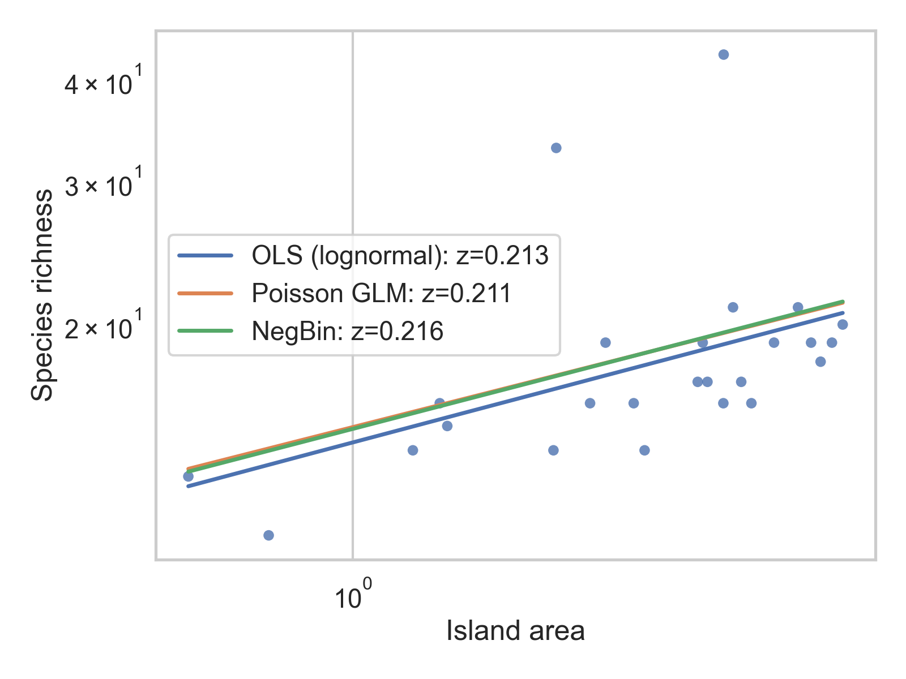
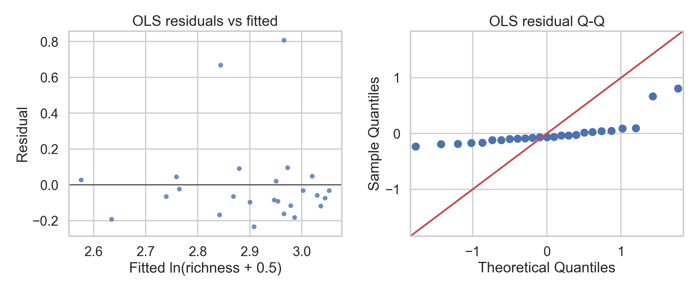
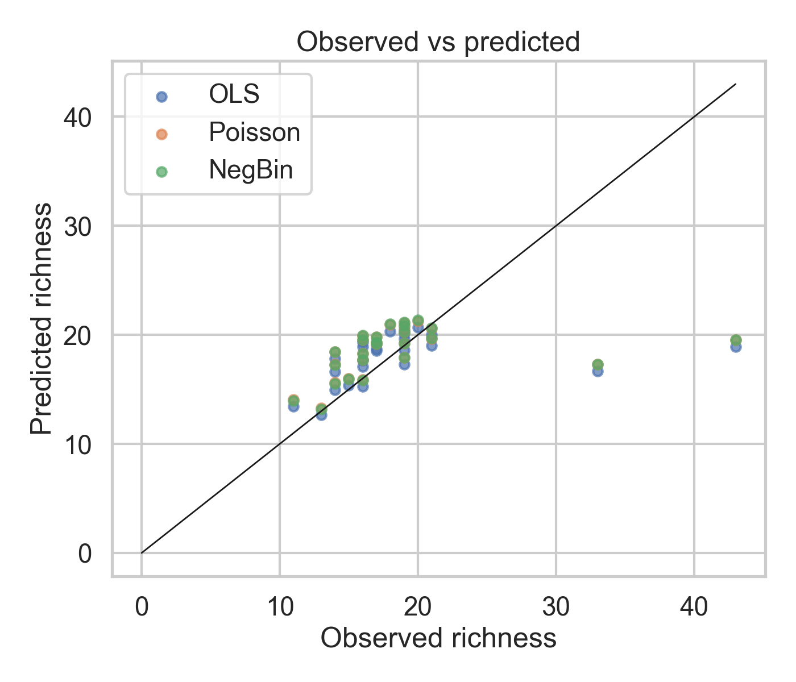
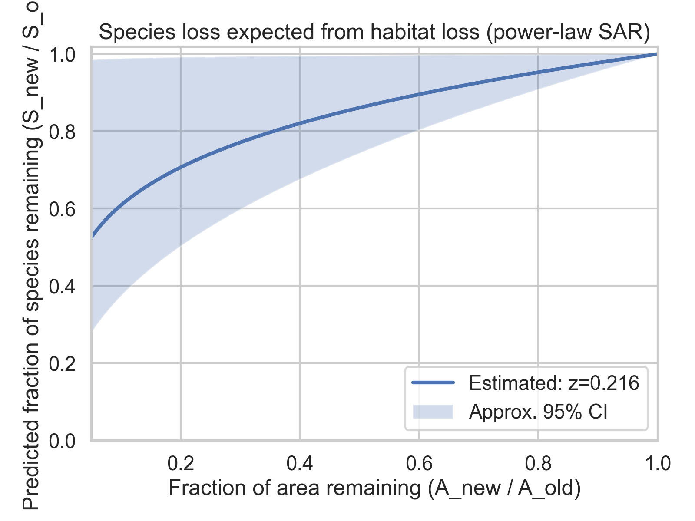

# Island biogeography: modeling the species–area relationship

## Overview
Island biogeography and reserve design often use the species–area relationship (SAR) to link habitat area to expected species richness. A common empirical model is a power law:

\[
S = cA^{z}
\]

where *S* is species richness, *A* is island area, *c* is a scaling constant, and *z* is the slope on log–log axes. The exponent *z* is especially policy-relevant because it implies how richness changes under proportional habitat loss: \(S_{new}/S_{old} = (A_{new}/A_{old})^{z}\).

This report estimates SAR parameters using `data/island_species.csv` and compares several standard fitting approaches.

## Data
We analyzed `island_species.csv`, containing island **area** and **species richness** (counts). After dropping missing values and filtering to positive area, the final sample size was **n = {n}** islands.

- Area range: **{amin:.3g}–{amax:.3g}** (data units)
- Richness range: **{smin:.3g}–{smax:.3g}** species

## Methods
### Models
We fit three variants of the power-law SAR:

1. **OLS on log-transformed richness** (lognormal error):
   \(\ln(S+0.5) = \alpha + z\ln(A) + \varepsilon\).
   A small constant (0.5) was added only to allow log-transform when richness is zero.

2. **Poisson GLM** (count model with log link):
   \(S \sim \text{Poisson}(\mu)\), \(\ln \mu = \alpha + z\ln(A)\).

3. **Negative binomial (NB2)** (overdispersed counts):
   \(S \sim \text{NegBin}(\mu, \theta)\), \(\ln \mu = \alpha + z\ln(A)\).

### Model comparison and validation
- We inspected **Poisson overdispersion** using \(\phi = \text{deviance}/\text{df}\).
- We compared fits using **AIC**.
- We evaluated out-of-sample accuracy with **5-fold cross-validation** (RMSE/MAE on the original richness scale).

### Figures
- Fig. 1: log–log scatter with fitted SAR curves.
- Fig. 2: OLS residual diagnostics.
- Fig. 3: observed vs predicted richness.
- Fig. 4: conservation “species loss vs area loss” curve implied by the estimated *z*.

## Results

### Estimated SAR exponent (*z*)
{model_table}

Key points:
- All models estimated a positive *z*, consistent with richness increasing with area.
- The **Poisson GLM exhibited overdispersion** (\(\phi\) substantially greater than 1), motivating the **negative binomial** model for inference and prediction.

### Predictive validation (5-fold CV)
{cv_table}

### Visual fit

## Conservation planning implications
Under the power-law SAR, a proportional area reduction from \(A\) to \(fA\) implies a richness reduction factor of \(f^{z}\). Using the **negative binomial** estimate of \(z\):

- If area is reduced to **50%** (\(f=0.5\)), expected richness becomes **\(0.5^{z}\)** of the original.
- If area is reduced to **10%** (\(f=0.1\)), expected richness becomes **\(0.1^{z}\)** of the original.

Figure 4 summarizes this relationship across plausible habitat-loss scenarios, with uncertainty propagated from the estimated standard error of \(z\).

### Practical interpretation
- **Exponent *z* is the leverage point**: higher *z* means that fragmentation or downsizing produces steeper losses in richness for the same proportional area loss.
- The SAR supports **prioritizing protection of large, contiguous habitat blocks**, because marginal area tends to yield diminishing returns when *z* < 1, yet proportional losses can still be substantial when habitat is heavily reduced.
- In planning, SAR-based projections should be treated as **first-order approximations**. Richness is also shaped by isolation, colonization/extinction dynamics, habitat heterogeneity, and sampling effort; these are not represented in an area-only model.

## Limitations and recommended extensions
1. **Single-predictor model**: Adding isolation (distance to mainland/nearest island) or habitat diversity can improve explanation and avoid attributing all variation to area.
2. **Causal interpretation**: SAR is often used for scenario analysis, but observed cross-sectional scaling does not guarantee that time-dynamic species loss after habitat reduction will match the same curve.
3. **Small-sample uncertainty**: When datasets are small, uncertainty in *z* can materially affect projected species losses; planning should incorporate sensitivity analysis.

## Reproducibility
All code to reproduce this analysis is in `code/run_analysis.py`. Generated outputs are saved under `outputs/` and figures under `report/images/`.
