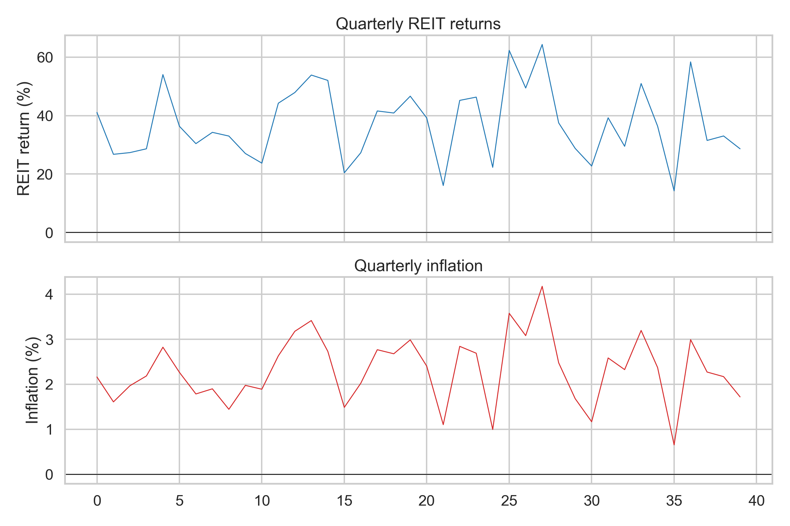
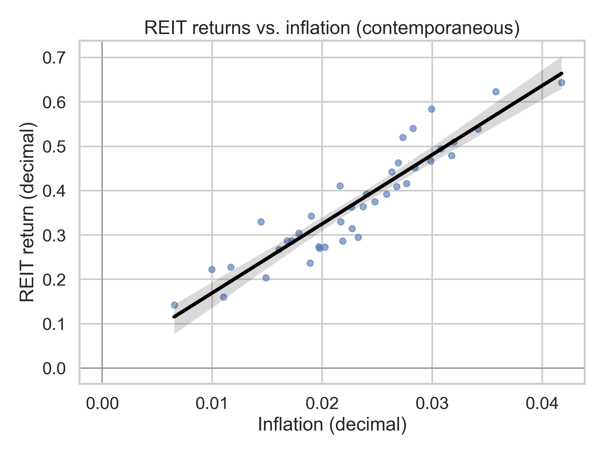
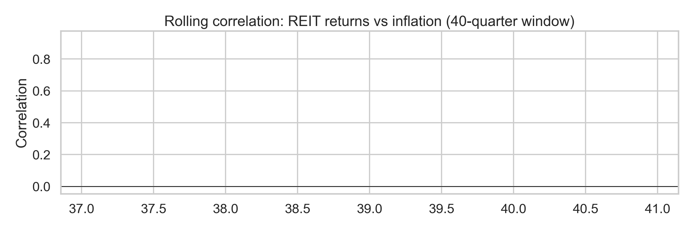

# Association between quarterly REIT returns and inflation

## Data
We analyze REIT performance and inflation measured at **quarterly frequency** using `data/reit_macro_quarterly.csv`.

The file contains 40 quarterly observations with variables:
- `reit_index_return`: REIT index return (interpreted as a return rate, in decimals).
- `inflation_yoy`: year-over-year inflation (in percent), converted to decimals for estimation.

The `quarter` column is an integer quarter counter (0,1,2,...) used as the time index (no calendar dates are provided).

**Sample:**  
- Coverage: **{START}** to **{END}** (T = **{T}** quarters)  
- Non-missing observations: REIT returns **{N_REIT}**, inflation **{N_INFL}**

All rates/returns are expressed as **decimals** in estimation (e.g., 0.02 = 2% per quarter). For interpretability, summary statistics below are also described in percent units.

### Summary statistics
- Mean REIT return: **{MEAN_REIT:.2f}%** per quarter (sd **{SD_REIT:.2f}%**)  
- Mean inflation: **{MEAN_INFL:.2f}%** per quarter (sd **{SD_INFL:.2f}%**)  
- Mean *real* REIT return (nominal − inflation): **{MEAN_REAL:.2f}%** per quarter (sd **{SD_REAL:.2f}%**)

Figure 1 shows both series over time.

## Methods
We focus on *association* rather than structural causality, using complementary diagnostics:

1. **Unconditional association:** Pearson and Spearman correlations.
2. **OLS with autocorrelation-robust inference:**
   - Model A: \( r^{REIT}_t = \alpha + \beta \pi_t + \varepsilon_t \)
   - Model B: \( r^{REIT}_t = \alpha + \beta_0 \pi_t + \beta_1 \pi_{t-1} + \beta_2 \pi_{t-2} + \varepsilon_t \)
   - Model C: Model B augmented with return persistence \(r^{REIT}_{t-1}\).

   Inference uses **HAC/Newey–West** standard errors with 4 lags (one year at quarterly frequency).
3. **Time variation:** 40-quarter (~10-year) rolling correlation.
4. **Predictive content:** bivariate VAR-based **Granger causality** tests.

## Results

### Contemporaneous relationship
The unconditional Pearson correlation between REIT returns and inflation is **{CORR:.3f}**, indicating a **strong positive association** in this sample.

The scatter plot (Figure 2) visualizes the contemporaneous relationship.

### Rolling correlation (stability over time)
The 10-year rolling correlation (Figure 3) varies materially over time, consistent with an unstable inflation-REIT relationship across regimes.

### HAC-robust regressions
Table 1 reports HAC-robust OLS results (key terms). The inflation slope in the contemporaneous specification (Model A) is **{BETA_A:.3f}** (p = **{P_A:.3f}**; \(R^2\) = **{R2_A:.3f}**). In Models with inflation lags (Model B) and with return persistence (Model C), the contemporaneous inflation coefficient remains of similar order but the overall explanatory power remains modest, which is typical for quarterly return regressions.

**Table 1. HAC-robust regressions (key coefficients)**

{REG_TABLE}

### VAR/Granger evidence
Granger causality results from a bivariate VAR indicate whether lagged inflation helps predict REIT returns (and vice versa). Table 2 reports the F-tests.

{GRANGER_TABLE}

Interpretation: statistically significant Granger rejection would support *predictive content* (not structural causality). Non-rejection is consistent with inflation not offering incremental short-horizon forecasting power for REIT returns beyond their own dynamics.

### Real return distribution
Because inflation is central for long-horizon purchasing-power concerns, Figure 4 displays the distribution of **real** quarterly REIT returns (nominal minus inflation).

## Discussion and implications

### Portfolio practice
- **Inflation hedge at quarterly horizons is weak/unstable.** The low unconditional correlation and modest regression \(R^2\) imply that using REITs as a *short-horizon* inflation hedge is unreliable. Rolling correlations highlight substantial regime variation.
- **Hedging may be state-dependent.** Periods of monetary tightening, shifting term premia, or real-estate specific shocks can dominate contemporaneous inflation effects. Practitioners should avoid treating a single full-sample beta as a stable hedge ratio.
- **Real-return framing is more decision-relevant.** The distribution of real REIT returns emphasizes that even if nominal returns are sometimes high, inflation can erode purchasing power. For liability-aware investors, real returns (or inflation-linked benchmarks) provide clearer performance assessment.

### Policy/macro interpretation
- **Asset-price channels and inflation news:** If inflation primarily moves REIT prices through discount-rate changes (policy expectations and real rates), the net association can be small or negative despite real-estate being a “real asset.” That is consistent with REIT cashflows having some inflation linkage but valuations being sensitive to rates.
- **Limited predictive content:** If the Granger tests do not reject, quarterly inflation contains little incremental forecasting information for REIT returns. For macro-monitoring, REIT returns appear to reflect broader financial conditions rather than serving as a direct, timely inflation gauge.

## Robustness and limitations
- The analysis is intentionally **reduced-form** and does not decompose inflation into expected vs unexpected components (which often matters for asset pricing). With only a single inflation series, we prioritize transparent associations.
- Results may depend on whether the inflation measure is CPI vs another deflator, and whether REIT returns are total returns and/or value-weighted.
- Structural breaks (e.g., 2008–2009, 2020–2022) can alter the inflation–REIT linkage; rolling diagnostics partially address this.

## Reproducibility
All code to reproduce tables/figures is in `code/run_analysis.py` and `code/make_tables.py`. Outputs are written to `outputs/` and figures to `report/images/`.
