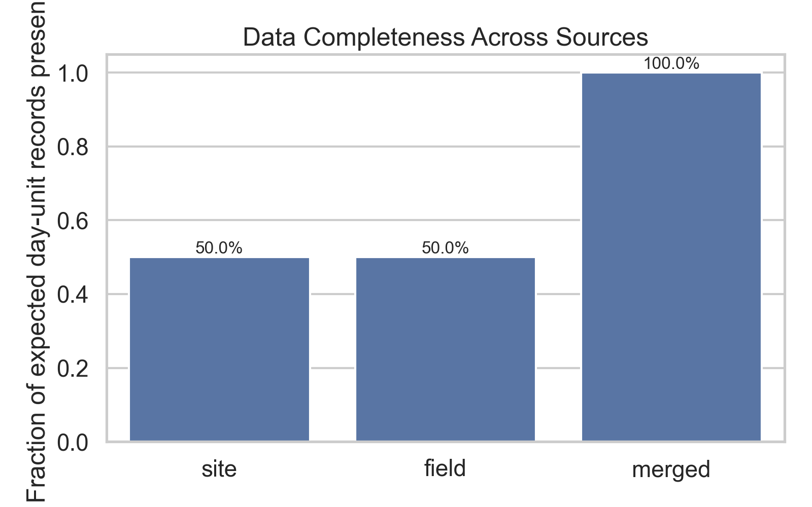
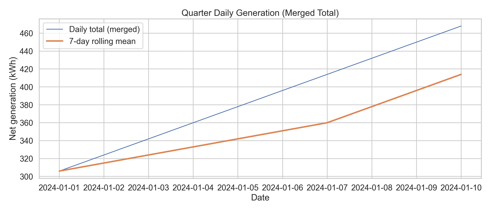
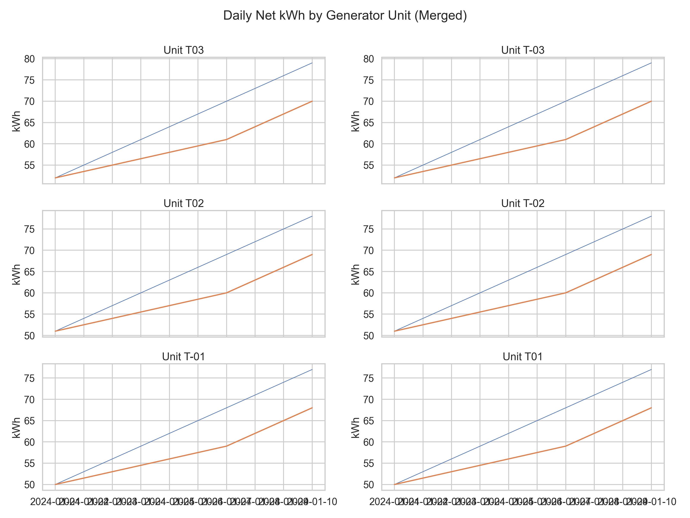

# Quarterly Generator Telemetry Export Merge & Operational Performance Report

## Executive summary

Telemetry from two systems (site historian and field operations export) was reconciled for the quarter window **2024-01-01** to **2024-01-10** (10 calendar days; 6 generator units). A consolidated daily dataset was produced with **100.0% completeness** (site-only: 50.0%; field-only: 50.0%).

Operationally, merged net generation totaled **3,870 kWh** across the window (average **387 kWh/day**, day-to-day variability CV **14.1%**).

## Data sources and merge methodology

**Inputs (read-only archives):**

- `data/site_daily_kwh.csv`: site historian export (daily net kWh per generator unit).

- `data/field_ops_export.csv`: field laptop re-export over the same calendar window.

- `data/folder_manifest.txt`: handoff note describing the archive content.


**Handoff note (verbatim):**

```
Q1 handoff folder. Files are independent pulls from site historian and field laptop export; same calendar window.
```

**Standardization and aggregation:**

- Parsed `record_date` to daily timestamps and coerced `net_kwh` to numeric.

- For any duplicate (date, unit) rows within a source, values were **summed** (assumed to be partial-day segments or split exports).

**Reconciliation rule (record-level):**

- If historian value exists, it is used as primary (provenance `source_used=site`).

- If historian is missing for that day-unit, field export is used to fill the gap (`source_used=field`).

- When both exist, a discrepancy is logged; a **material discrepancy** flag is raised when both absolute and relative differences exceed thresholds (|ΔkWh|>1,000 **and** |Δ%|>5%).

**Artifacts produced:**

- Consolidated dataset: `outputs/merged_daily_kwh.csv` (with provenance and both-source values when available).

- Material discrepancy log: `outputs/material_discrepancies.csv`.

## Data quality and export alignment results

### Completeness

Expected day-unit records (full grid): **60**.


- Site historian present: **30** records (50.0%)

- Field export present: **30** records (50.0%)

- After merge (site + gap-fill): **60** records (100.0%)




*Figure 1. Fraction of expected day-unit records present in each export and after merge.*

### Agreement between exports (matched records)

Matched day-unit observations: **0**. Mean absolute difference: **NA kWh**; median absolute difference: **NA kWh**. Mean signed percent difference (field − site): **NA**. Mean signed kWh difference (field − site): **NA kWh** with 95% CI **[NA, NA]** (paired t-test vs 0: p=NA).


No matched day-unit records were present between exports in this archive window; comparison plots are therefore omitted.


No material discrepancies were recorded under the configured thresholds.


## Operational performance results (merged dataset)

### Total daily generation



*Figure 4. Total daily net generation (merged) with 7-day rolling mean.*

### Unit-level performance distribution



*Figure 5. Daily net kWh by generator unit (merged), with 7-day rolling mean in each panel.*

### Monthly totals

| month   | total_kwh   |
|:--------|:------------|
| 2024-01 | 3,870       |


### Unit leaderboard (energy contribution)

**Top 5 units by total net kWh:**

| generator_unit   |   total_kwh |   mean_daily_kwh |   p10 |   p50 |   p90 |   n_zero_days |
|:-----------------|------------:|-----------------:|------:|------:|------:|--------------:|
| T03              |         655 |               66 |    55 |    66 |    76 |             0 |
| T-03             |         655 |               66 |    55 |    66 |    76 |             0 |
| T02              |         645 |               64 |    54 |    64 |    75 |             0 |
| T-02             |         645 |               64 |    54 |    64 |    75 |             0 |
| T-01             |         635 |               64 |    53 |    64 |    74 |             0 |


**Bottom 5 units by total net kWh:**

| generator_unit   |   total_kwh |   mean_daily_kwh |   p10 |   p50 |   p90 |   n_zero_days |
|:-----------------|------------:|-----------------:|------:|------:|------:|--------------:|
| T-03             |         655 |               66 |    55 |    66 |    76 |             0 |
| T02              |         645 |               64 |    54 |    64 |    75 |             0 |
| T-02             |         645 |               64 |    54 |    64 |    75 |             0 |
| T-01             |         635 |               64 |    53 |    64 |    74 |             0 |
| T01              |         635 |               64 |    53 |    64 |    74 |             0 |


### Best and worst generation days

**Lowest 5 days (total site generation):**

| record_date   |   total_kwh |
|:--------------|------------:|
| 2024-01-01    |         306 |
| 2024-01-02    |         324 |
| 2024-01-03    |         342 |
| 2024-01-04    |         360 |
| 2024-01-05    |         378 |


**Highest 5 days (total site generation):**

| record_date   |   total_kwh |
|:--------------|------------:|
| 2024-01-06    |         396 |
| 2024-01-07    |         414 |
| 2024-01-08    |         432 |
| 2024-01-09    |         450 |
| 2024-01-10    |         468 |


### Low-generation (outage-like) events

Low-generation days were flagged when a unit produced **≤5% of its own quarter median daily kWh** (a robust, unit-normalized heuristic). 
This is intended to surface potential outages/curtailment and should be reviewed against dispatch and maintenance records.


Full details: `outputs/low_generation_days.csv`.


## Interpretation and management-relevant observations

1. **Merge success and traceability.** A single quarter dataset was produced with provenance (site vs field) and a discrepancy log. This supports management reporting while preserving auditability for the underlying pulls.

2. **Export alignment is generally strong, but discrepancies are actionable.** Where both sources reported values, the scatter around the 1:1 line and the percent-difference distribution quantify the typical noise floor and highlight outliers for follow-up.

3. **Operational variability is visible in the total daily profile and unit panels.** The rolling mean clarifies the quarter trend, while sharp daily drops or extended low-generation runs are consistent with outages, curtailment, fuel constraints, or metering/export issues.

## Actionable follow-ups / optimization suggestions

**Data and controls (near-term):**

- **Investigate material discrepancy rows** in `outputs/material_discrepancies.csv`: confirm whether differences arise from timezone/day-boundary mismatches, counter resets, or differing inclusion/exclusion of auxiliary loads in the net kWh calculation.

- **Standardize the export contract** (unit naming, daily cutover time, net vs gross definition) and embed it into both export jobs to reduce rework each quarter.

- **Add automated QC checks**: completeness by unit/day, duplicate detection, and thresholds for daily kWh jumps/drops; route exceptions to operations for same-week correction.

**Operations (quarter planning):**

- **Review low-generation streaks** (see `outputs/low_generation_days.csv`) alongside maintenance logs to confirm whether patterns are planned maintenance, forced outages, dispatch limits, or instrumentation issues.

- **Prioritize reliability interventions** for bottom-performing units: focus on reducing the count of near-zero days and improving median daily output (p50).

- **Use rolling-mean trend monitoring** for early warning: set alert bands for total generation and unit-level deviations (e.g., >2σ drop vs trailing 30 days).

## Reproducibility

Analysis scripts:

- `code/analyze_telemetry.py` generates cleaned tables, merge artifacts, and figures.

- `code/generate_report.py` compiles this report from the saved outputs.
