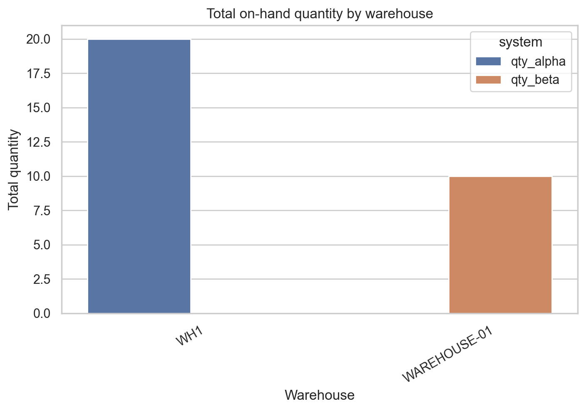
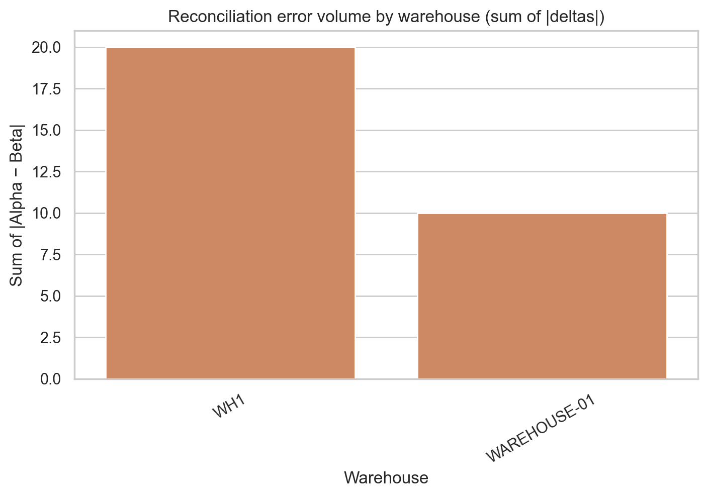
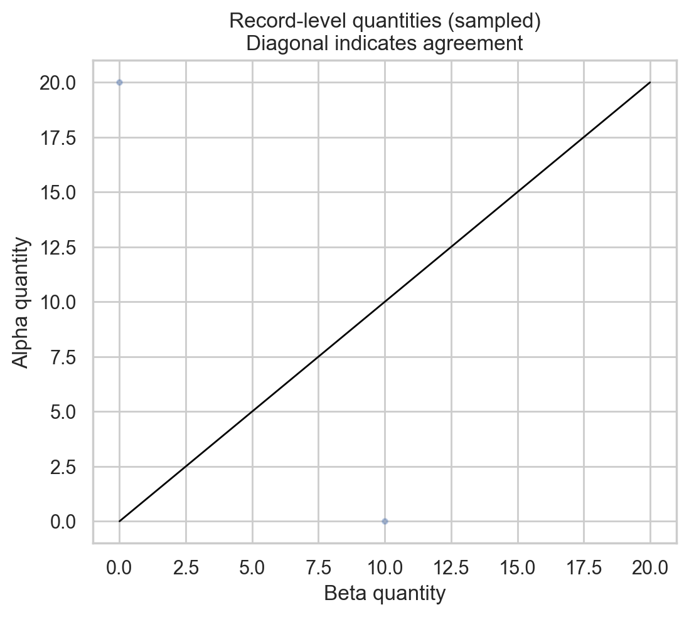
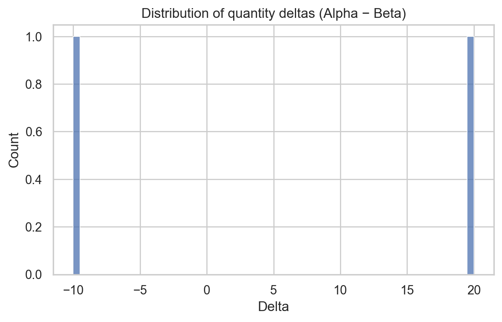
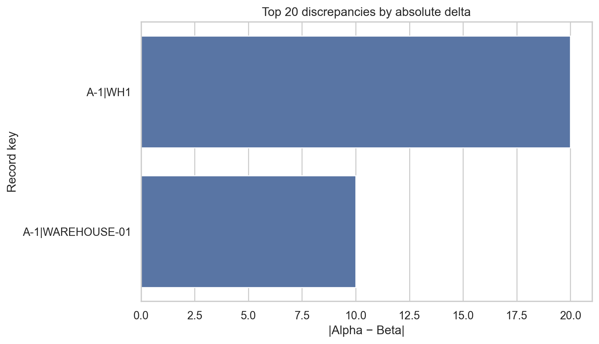
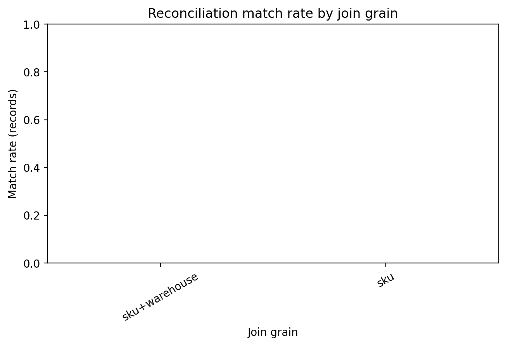

# Inventory Reconciliation Report — WMS Alpha vs WMS Beta

_Generated: 2026-04-27 22:42_

## Executive summary

This report reconciles inventory positions between two warehouse management system (WMS) exports (Alpha and Beta). Records were normalized (SKU and dimensional keys standardized; quantity coerced to numeric), aggregated to a common join grain, and compared via an outer join to identify matches, mismatches, and missing records.

**Headline results at grain `sku+warehouse`:** match rate 0.0% across 2 union records; Alpha totals 20.00 vs Beta 10.00; net delta (Alpha−Beta) 10.00 with total absolute delta 30.00.

### Management KPIs

| KPI                      | Value         |
|:-------------------------|:--------------|
| Join grain (keys)        | sku+warehouse |
| Union records            | 2             |
| Match rate (records)     | 0.0%          |
| Matched records          | 0             |
| Mismatched records       | 0             |
| Missing in Alpha         | 1             |
| Missing in Beta          | 1             |
| Total qty (Alpha)        | 20.00         |
| Total qty (Beta)         | 10.00         |
| Net delta (Alpha − Beta) | 10.00         |
| Total abs delta          | 30.00         |
| P95 abs delta            | 19.50         |

## Data overview and preparation

### Source extracts and detected schema mapping

| System   |   Rows |   Invalid qty rows | Qty column   | SKU column   | Warehouse   | Location   | Lot   | Status   |
|:---------|-------:|-------------------:|:-------------|:-------------|:------------|:-----------|:------|:---------|
| Alpha    |      2 |                  0 | qty          | sku          | warehouse   |            |       |          |
| Beta     |      1 |                  0 | Quantity     | SKU          | Site        |            |       |          |

### Normalization rules

- **Key fields**: SKU, and where available warehouse/location/lot/status, were converted to uppercase strings and trimmed.
- **Quantity**: coerced to numeric; non-numeric values treated as 0 for aggregation but counted as data-quality issues.
- **Aggregation**: records were summed at the selected join grain to avoid one-to-many inflation.

## Reconciliation methodology

1. **Detect schema** in each export (SKU, quantity, and optional dimensional columns).
2. **Select join grain** as the finest set of common keys across both systems (preferring SKU+warehouse+location+lot+status).
3. **Aggregate** each system to the join grain using summed on-hand quantity.
4. **Outer-join** the two aggregates and compute: `delta = qty_alpha − qty_beta`, `abs_delta = |delta|`.
5. **Classify each joined record**:
   - `match`: present in both and `abs_delta = 0`
   - `mismatch`: present in both and `abs_delta > 0`
   - `missing_in_alpha` / `missing_in_beta`: present only in the other system

## Results

Key concentration signals:

- Largest discrepancy volume by warehouse: **WH1** (sum |delta| = 20.00; match rate 0.0%).

### Status mix and discrepancy volume

**Figures:** record counts and discrepancy volume by reconciliation status.

- 

- 

### Warehouse-level reconciliation (top 10 by discrepancy volume)

| warehouse    |   records | match_rate   |   qty_alpha |   qty_beta |   net_delta |   abs_delta |   missing_in_alpha |   missing_in_beta |
|:-------------|----------:|:-------------|------------:|-----------:|------------:|------------:|-------------------:|------------------:|
| WH1          |         1 | 0.0%         |          20 |          0 |          20 |          20 |                  0 |                 1 |
| WAREHOUSE-01 |         1 | 0.0%         |           0 |         10 |         -10 |          10 |                  1 |                 0 |

**Figures:** totals and reconciliation error by warehouse.

- 

- 

### Discrepancy structure

**Figures:** record-level comparison, delta distribution, and largest discrepancies.

- 

- 

- 

### Top discrepancies (first 15 of top 100 by |delta|)

| sku   | warehouse    |   qty_alpha |   qty_beta |   delta |   abs_delta | _merge     | recon_status     |
|:------|:-------------|------------:|-----------:|--------:|------------:|:-----------|:-----------------|
| A-1   | WH1          |          20 |          0 |      20 |          20 | left_only  | missing_in_beta  |
| A-1   | WAREHOUSE-01 |           0 |         10 |     -10 |          10 | right_only | missing_in_alpha |

### Sensitivity to join grain

Reconciliation outcomes can change materially depending on whether location/lot/status are included in the join keys. A lower-dimensional grain (e.g., SKU-only) can hide discrepancies that net to zero across sublocations or lots, while a higher-dimensional grain can reveal allocation or attribute mismatches.

| grain         |   total_records_union | match_rate_records   |   total_abs_delta |   net_delta_alpha_minus_beta |
|:--------------|----------------------:|:---------------------|------------------:|-----------------------------:|
| sku+warehouse |                     2 | 0.0%                 |                30 |                           10 |
| sku           |                     1 | 0.0%                 |                10 |                           10 |

- 

## Validation checks and limitations

- **Net vs absolute discrepancy**: a small net delta can still coincide with a large absolute delta, indicating compensating errors across bins/lots.
- **Non-numeric quantities**: invalid quantity rows were coerced to 0 for aggregation, which prevents failures but may understate inventory.
- **Snapshot alignment**: if extracts were taken at different times, true operational movements (receipts/shipments) will appear as discrepancies.
- **Unit-of-measure**: this workflow assumes both systems report comparable units (eaches). If UoM differs, quantities must be converted before reconciliation.

## Recommendations for management and operations

1. **Prioritize warehouses / records with largest |delta|** (see warehouse table and Top Discrepancies) to reduce discrepancy volume quickly.
2. **Investigate systematic drivers**: if mismatches cluster by status (e.g., HOLD vs AVAILABLE) or lot, validate attribute mapping and interface logic.
3. **Align snapshot timing**: standardize extract cutoffs (or reconcile using movement transactions) to separate timing noise from true master-data issues.
4. **Establish a recurring control**: schedule this reconciliation daily/weekly with thresholds (e.g., alert when |delta|>X or match rate drops).

---

### Reproducibility

All code used to generate this report is in `code/`, with intermediate outputs in `outputs/`. Key files:
- `code/reconcile_inventory.py` (core normalization + reconciliation + figures)
- `code/multigrain_analysis.py` (grain sensitivity)
- `outputs/reconciliation_detail.csv` (full record-level reconciliation results)
