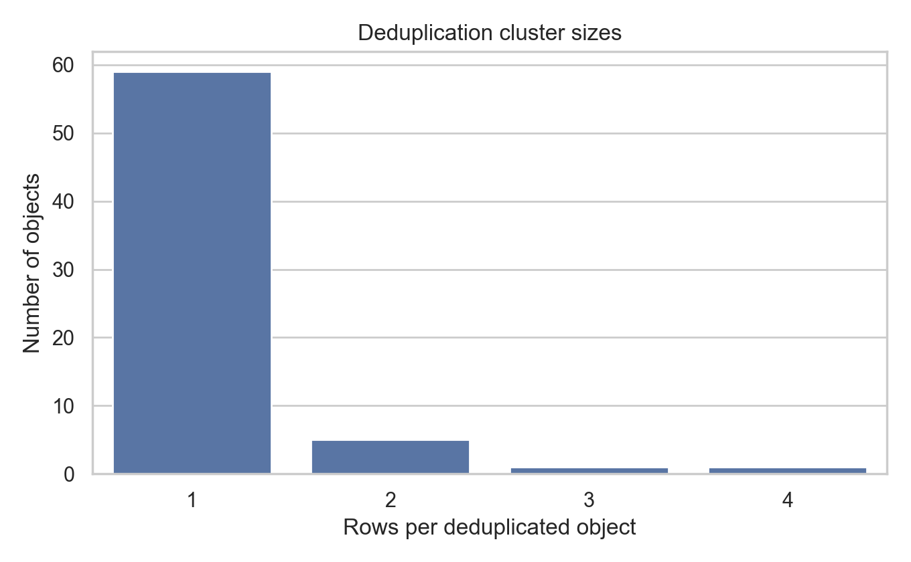
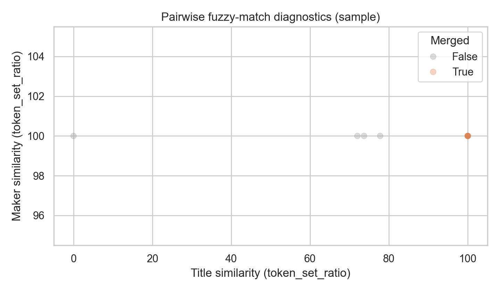
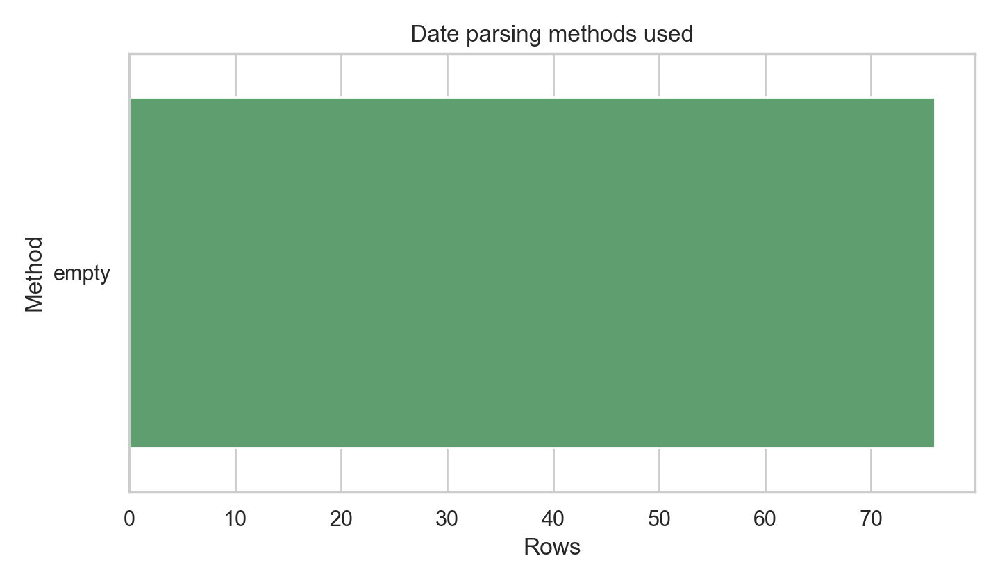

# DigitalHumanities MuseumProvenanceMerge: deduplicated catalog + temporal distribution

## Abstract
This report consolidates two museum collection exports (`museum_export_a.csv`, `museum_export_b.csv`) into a single deduplicated, analysis-ready object catalog. I harmonize heterogeneous schemas into a shared set of descriptive fields, parse and normalize production-date information, and deduplicate records using a two-stage linkage strategy (exact identifier matches, then conservative fuzzy matching on title/creator with date-consistency checks). Finally, I summarize how the collection is distributed over time using decade- and century-level aggregations derived from parsed date ranges.

## Data overview
Two CSV batches were provided:

- **Batch A**: `data/museum_export_a.csv`
- **Batch B**: `data/museum_export_b.csv`

The exports are not assumed to share identical schemas; instead, the merge process uses column-name substring matching to locate likely identifier, title, maker/artist, medium, dimensions, and date fields.

Key counts (after concatenation):

- Rows in A: **{n_rows_A}**
- Rows in B: **{n_rows_B}**
- Combined rows (A+B): **{n_rows_combined}**
- Deduplicated objects (canonical catalog rows): **{n_objects_dedup}**
- Net reduction from deduplication: **{dedup_reduction}** rows ({dedup_reduction_pct:.1f}% of combined rows)

(Computed from `outputs/summary.json`.)

## Methods

### 1) Schema harmonization into a “long” table
Each export is mapped into a standardized “long” format (`outputs/merged_long.csv`) with the following harmonized fields:

- `id_raw`, `id_norm` (normalized accession/inventory/catalog-like identifier when available)
- `title`, `maker`, `culture`, `medium`, `dimensions`
- `date_text` (free-text date/period field)
- `date_begin`, `date_end` (numeric year range; may be missing)
- provenance/traceability fields: `source` (A/B), `source_row` (row index), plus all original columns copied through with `orig_A_*` or `orig_B_*` prefixes.

String normalization is applied for matching:

- Identifier normalization: uppercase + whitespace removal (e.g., `"  1970.1 " → "1970.1"`)
- Text normalization for fuzzy matching: lowercase, punctuation removal, and whitespace collapsing.

### 2) Production-date parsing
Date values appear as a mix of numeric years and free text. The pipeline converts `date_text` into an approximate year range `(date_begin_parsed, date_end_parsed)` using rule-based parsing:

- single year (e.g., `"1870"`)
- ranges (e.g., `"1870–1880"`)
- decades (e.g., `"1870s"`)
- centuries (e.g., `"19th century"`, including BCE/BC handling)
- fallback extraction of any 1–4 digit year-like tokens

If the export contains explicit numeric begin/end date columns, those are preferred (`date_begin_raw`, `date_end_raw`). The final `date_begin`/`date_end` fields use raw values when present, otherwise parsed values.

A diagnostic breakdown of parsing methods is shown in Figure 3.

### 3) Deduplication and canonical record construction
Deduplication is performed on the concatenated long table using a union-find (disjoint-set) clustering approach:

**Stage 1 — exact ID linkage**
- Any rows with the same non-empty `id_norm` are merged into the same cluster.

**Stage 2 — conservative fuzzy linkage**
- Candidate comparisons are restricted via blocking on the first 8 characters of normalized title and first 4 characters of normalized maker.
- Similarity uses token-set ratio (RapidFuzz when available; otherwise a stdlib fallback).
- Two rows are merged if:
  - combined score `0.6*title + 0.4*maker ≥ 92`, with additional minima (`title ≥ 88`, `maker ≥ 80`), and
  - date consistency holds when numeric dates exist (|Δ| ≤ 25 years on begin/end).

This intentionally prioritizes *precision over recall* to avoid false merges in a catalog context.

**Canonical row per cluster**
For each cluster, a single canonical row is produced (`outputs/dedup_catalog.csv`) by:

1. selecting the row with the most filled core fields,
2. filling missing values from other rows in the cluster (deterministic order),
3. recording provenance fields `sources`, `source_rows`, and `n_merged_rows`.

Cluster-size distribution is shown in Figure 1; fuzzy-match diagnostics are shown in Figure 2.

## Results

### Deduplication outcomes
The deduplicated catalog contains **{n_objects_dedup}** objects derived from **{n_rows_combined}** raw rows.

Cluster sizes (rows per object) indicate the extent of duplication and multi-source overlap (Figure 1). The fuzzy-matching diagnostic plot (Figure 2) provides a sanity check that merges concentrate in the high-similarity region.





Example multi-row clusters (sample) from `outputs/dedup_clusters.jsonl`:

{example_clusters_table}

### Date coverage and parsing
A total of **{n_objects_with_date_mid} / {n_objects_dedup}** objects have a usable estimated production year (`date_mid`), where `date_mid` is the midpoint of `(date_begin, date_end)` when both exist.

- Objects with CE (≥ 0) mid-years: **{n_objects_ce_with_date_mid}**
- Objects with BCE (< 0) mid-years: **{n_objects_bce_with_date_mid}**

Date parsing methods used across *rows* (not deduplicated objects) are summarized in Figure 3.



### Temporal distribution of the collection
Using the deduplicated catalog and estimated production mid-years:

1. **By decade (CE only)**: Figure 4 shows the distribution over decades for objects with non-negative `date_mid`.
2. **By century (CE and BCE)**: Figure 5 shows counts by century, using negative values to represent BCE centuries (e.g., -1 = 1st century BCE).


Top centuries by object count (derived from `outputs/century_counts.csv`):

{top_centuries_table}

Top decades by object count (derived from `outputs/decade_counts.csv`; CE only):

{top_decades_table}

## Discussion and limitations

1. **Identifier heterogeneity**: Exact-ID clustering assumes identifier fields (accession/inventory/catalog numbers) are consistently recorded. If IDs are missing or inconsistently formatted across systems, duplicates may remain unmerged.

2. **Conservative fuzzy linkage**: The fuzzy stage uses strict thresholds and blocking, which reduces false positives but may miss legitimate duplicates when titles/maker names differ substantially (e.g., translations, abbreviations, “Unknown”).

3. **Date uncertainty**: Many museum date strings encode uncertainty ("circa", broad periods). The rule-based parser collapses these to approximate numeric ranges; results should be interpreted as *estimated production time* rather than exact years.

4. **Bias from missing dates**: Temporal distributions exclude objects without parsable/available dates. Any collection-wide inference should report coverage (done above) and consider missingness mechanisms.

## Reproducibility and outputs

Run the full pipeline:

```bash
python code/merge_and_analyze.py
```

Key outputs:

- `outputs/merged_long.csv` — standardized concatenation of A and B with provenance columns
- `outputs/dedup_catalog.csv` — one row per deduplicated object (canonicalized)
- `outputs/pairwise_dedup_diagnostics.csv` — pairwise scores for fuzzy comparisons (diagnostic)
- `outputs/century_counts.csv`, `outputs/decade_counts.csv` — time summaries for downstream analysis
- Figures: `report/images/fig1_*.png` … `fig5_*.png`

---

**Implementation note.** The deduplication strategy is designed for collection-wide analysis (aggregate counts, temporal trends) rather than definitive curatorial reconciliation. For high-stakes object-level integration, a human-in-the-loop review of proposed merges (especially fuzzy matches) is recommended.
